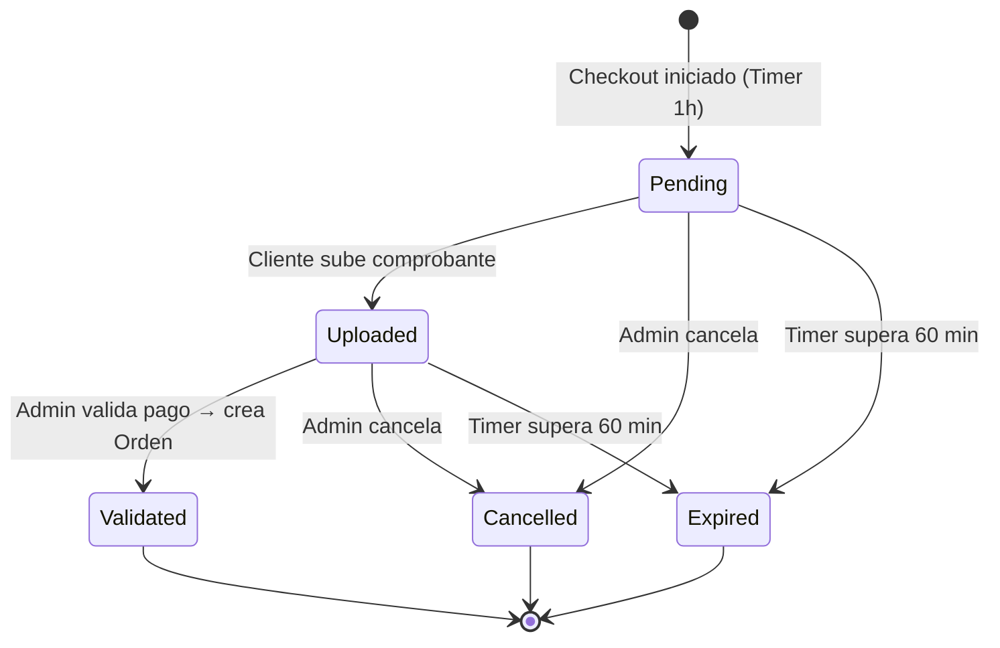

# Reservaciones

## Qué es

La **Reservación** (`reservations`) es un estado temporal de checkout creado cuando un Cliente inicia una compra. Tiene una ventana de 60 minutos para completarse — si no se valida en ese tiempo, expira automáticamente.

La Reservación es el punto de entrada del flujo de venta de la Tienda Online (Fase 3). Al validarse, genera una **Orden** permanente.

---

## Flujo de estados



```
PENDING → UPLOADED → VALIDATED → (orden creada)
PENDING → CANCELLED
UPLOADED → CANCELLED
PENDING / UPLOADED → EXPIRED (automático, tras 1 hora)
```

---

## Endpoints vigentes

Base path: `/api/v1/reservations`

### Listar reservaciones

```
GET /api/v1/reservations
```

| Param | Tipo | Requerido | Descripción |
|---|---|---|---|
| `status` | `string` | No | Filtrar por estado (`PENDING`, `UPLOADED`, `VALIDATED`, `EXPIRED`, `CANCELLED`) |

**Response `200 OK`** — Array de `ReservationResponse`

---

### Obtener reservación por ID

```
GET /api/v1/reservations/{id}
```

| Código | Descripción |
|---|---|
| `200` | Encontrada |
| `404` | No encontrada |

---

### Crear reservación

```
POST /api/v1/reservations
```

**Request Body:**

```json
{
  "clientId": "uuid",
  "items": [
    { "inventoryId": 1, "qty": 1 }
  ]
}
```

| Campo | Tipo | Req. | Descripción |
|---|---|---|---|
| `clientId` | `string (uuid)` | No | Puede vincularse después via endpoint `/client` |
| `items` | `array` | Sí | Uno o más ítems de servicio |

| Código | Descripción |
|---|---|
| `201` | Creada |
| `400` | Request inválido o stock insuficiente |

---

### Subir comprobante de pago

```
PUT /api/v1/reservations/{id}/receipt
```

Transiciona `PENDING → UPLOADED`.

**Request Body:**

```json
{ "receiptUrl": "https://s3.amazonaws.com/..." }
```

| Código | Descripción |
|---|---|
| `200` | Comprobante subido |
| `400` | Estado inválido o URL duplicada (BR-14) |
| `404` | No encontrada |

---

### Validar pago y crear orden

```
PUT /api/v1/reservations/{id}/validate
```

El Admin valida el pago. Transiciona `UPLOADED → VALIDATED` y crea una Orden.

**Request Body:**

```json
{ "notes": "Payment confirmed via transfer" }
```

| Código | Descripción |
|---|---|
| `200` | Validada, orden creada |
| `400` | Estado no es UPLOADED |
| `404` | No encontrada |

---

### Cancelar reservación

```
PUT /api/v1/reservations/{id}/cancel
```

Solo `PENDING` o `UPLOADED` pueden cancelarse.

| Código | Descripción |
|---|---|
| `200` | Cancelada |
| `400` | No puede cancelarse en estado actual |
| `404` | No encontrada |

---

### Vincular cliente a reservación

```
PUT /api/v1/reservations/{id}/client?clientId={uuid}
```

Vincula un cliente existente a una reservación creada sin cliente.

| Código | Descripción |
|---|---|
| `200` | Cliente vinculado |
| `404` | Reservación o cliente no encontrado |

---

### Modelo de respuesta — `ReservationResponse`

```json
{
  "id": "uuid",
  "clientId": "uuid",
  "status": "PENDING",
  "discount": 0.00,
  "total": 40.00,
  "receiptUrl": "https://...",
  "expirationDate": "2026-03-24T01:00:00Z",
  "createdAt": "2026-03-24T00:00:00Z",
  "details": [
    {
      "id": "uuid",
      "inventoryId": 1,
      "qty": 1,
      "unitPrice": 40.00,
      "subtotal": 40.00
    }
  ]
}
```

Todos los valores monetarios en **GTQ**.

---

## Esquema de base de datos

Tabla: `reservations`

| Campo | Tipo | Descripción |
|---|---|---|
| `id` | `UUID` PK DEFAULT `gen_random_uuid()` | Identificador único |
| `client_id` | `BIGINT` FK → `clients.id` | Cliente que inició el checkout (nullable) |
| `status` | `VARCHAR(20)` NOT NULL DEFAULT `'PENDING'` | `PENDING`, `UPLOADED`, `VALIDATED`, `EXPIRED`, `CANCELLED` |
| `discount` | `NUMERIC(10,2)` | Descuento aplicado (GTQ) |
| `total` | `NUMERIC(10,2)` | Total de la reservación (GTQ) |
| `receipt_url` | `TEXT` | Link S3 al comprobante de pago |
| `expiration_date` | `TIMESTAMPTZ` | Fecha/hora de expiración automática |
| `created_at` | `TIMESTAMPTZ` NOT NULL DEFAULT `now()` | |

> **Nota:** El campo `status` fue agregado en la migración **V3**, no existía en V1.

**Tabla relacionada: `reservation_details`** (creada en V3)

Líneas de ítems dentro de una reservación. `subtotal` es una columna generada — no se escribe directamente.

| Campo | Tipo | Descripción |
|---|---|---|
| `id` | `UUID` PK DEFAULT `gen_random_uuid()` | |
| `reservation_id` | `UUID` FK → `reservations.id` ON DELETE CASCADE | |
| `inventory_id` | `BIGINT` | Referencia al ítem de catálogo (sin FK formal aún) |
| `qty` | `INT` NOT NULL | Cantidad |
| `unit_price` | `NUMERIC(10,2)` NOT NULL DEFAULT `0` | Precio unitario |
| `subtotal` | `NUMERIC(10,2)` GENERATED AS `(qty * unit_price)` STORED | No modificable directamente |

> Ver esquema completo en [`../system/schema.md`](../system/schema.md)

---

## Reglas de negocio

- **BR-12 — Expiración tras 1 hora:** Una Reservación transiciona a `EXPIRED` si no se completa dentro de 3600 segundos.
- **BR-13 — Restricciones de cancelación:** Solo reservaciones en `PENDING` o `UPLOADED` pueden cancelarse. `VALIDATED` o `EXPIRED` no pueden.
- **BR-14 — `receipt_url` único:** Subir una URL de comprobante duplicada en cualquier reservación se rechaza para prevenir fraude.
- **BR-20 — Transición a Orden:** Una Orden solo se genera cuando un Admin valida manualmente una reservación `UPLOADED`.

---

## Dependencias

| Módulo | Relación |
|---|---|
| [`clientes.md`](clientes.md) | Un cliente puede crear múltiples reservaciones (1:N) |
| [`ordenes.md`](ordenes.md) | Una reservación validada genera una orden (1:1) |

---

## ⚠️ Notas para Claude Code

El esquema de base de datos usa Flyway con campos varchar. No existen enums a nivel de base de datos. Los enums presentes en el código Java son de la v1 y están deprecados para el esquema actual — no usarlos como referencia para migraciones ni queries.

- `id` de reservaciones es `UUID` (PK directo, sin columna `uuid` separada). `client_id` referencia `clients.id` que es `BIGINT`.
- `status` es `varchar`. Valores válidos: `PENDING`, `UPLOADED`, `VALIDATED`, `EXPIRED`, `CANCELLED`. Fue agregado en **V3** — la tabla original (V1) no tenía este campo.
- La expiración automática se maneja via scheduler/cronjob — no es un trigger de BD.
- La URL de `receipt_url` apunta a AWS S3. La subida del archivo al bucket se gestiona en el backend antes de guardar la URL.
- La tabla `reservation_details` tiene `subtotal` como columna GENERATED — nunca se inserta directamente. Solo se insertan `qty` y `unit_price`.
- `inventory_id` en `reservation_details` no tiene FK formal aún — es una referencia lógica.
