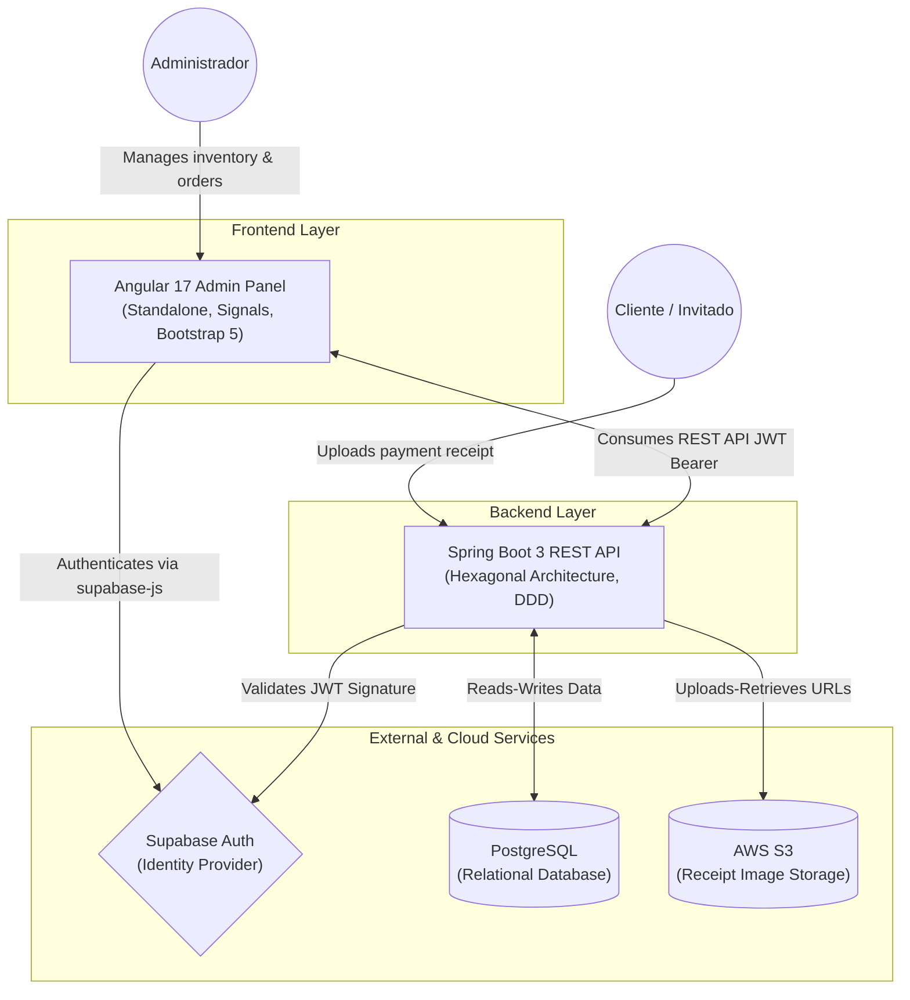
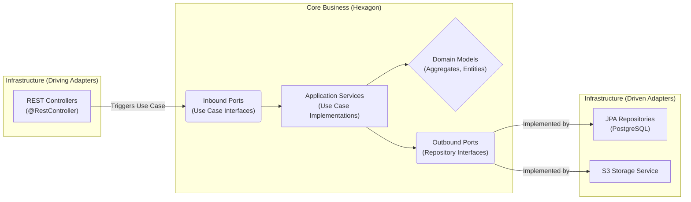
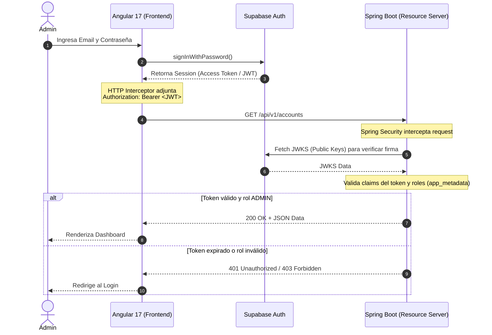

# Neversion — Arquitectura del Sistema

> Consolida la arquitectura técnica del sistema, los diagramas de componentes y las metodologías de desarrollo.

---

## 1. Visión de Alto Nivel

El sistema sigue una arquitectura **desacoplada API-driven**. El frontend actúa como cliente puro consumiendo una API RESTful segura provista por el backend.



---

## 2. Backend — Arquitectura Hexagonal (Ports & Adapters) y DDD

El backend en Spring Boot sigue estrictamente **Hexagonal Architecture** combinada con **Domain-Driven Design (DDD)**. Esto aísla la lógica de negocio del framework, la base de datos y la UI.



### Capas del Backend

| Capa | Contenido | Reglas |
|---|---|---|
| **Domain** | Aggregates, Entities, Value Objects | Pure Java, cero dependencias de framework |
| **Application** | Use Cases (Inbound Ports + Application Services) | Orquesta lógica de negocio |
| **Infrastructure** | REST Controllers, JPA Repositories, S3 Adapter | Adapters al mundo externo |

**Convenciones de código:**

- Naming: `com.neversion.api.<feature>.<layer>`
- Interfaces: `<Name>Port`, `<Name>UseCase`
- Inyección: solo via constructor (no `@Autowired` en campos)
- DTOs: Java Records
- Mappers: `RequestMapper`, `ResponseMapper`, `EntityMapper` (no MapStruct)
- Soft Delete: `@SQLDelete` + `@SQLRestriction`

---

## 3. Frontend — Angular 17

```
panel/ (Angular 17, pnpm)
├── Standalone Components     ← No NgModule
├── Signals                   ← signal(), computed(), effect() para state
├── Reactive Forms            ← Para formularios
├── Smart / Dumb Components   ← Pages (Smart) + UI elements (Dumb)
└── Bootstrap 5 + SCSS/OKLCH  ← Estilos
```

- **Smart Components (Pages):** Inyectan servicios, manejan estado.
- **Dumb Components (UI Elements):** Reciben datos via `@Input()`, emiten eventos via `@Output()`.
- **Paginación (Sprint 1):** Backend retorna listas completas. El frontend almacena en Signal y deriva vistas paginadas con `computed()`.

---

## 4. Flujo de Autenticación (OAuth2 / JWT)

Supabase Auth actúa como Identity Provider. Spring Boot actúa como OAuth2 Resource Server.



- **Roles:** Gestionados via JWT claims (`app_metadata`).
- **JWKS:** Spring Boot valida la firma descargando las public keys de Supabase.

---

## 5. Metodologías de Desarrollo

El proyecto adopta un enfoque híbrido:

### Modelo Incremental (Estrategia macro)
- El sistema se divide en incrementos funcionales. Cada uno entrega un producto operativo en producción.
- **Increment 1 / Sprint 1:** Capacidades operativas mínimas para lanzamiento manual.
- **Increment 2 / Sprint 2+:** Automatizaciones, flujos complejos, portal de autoservicio.

### Scrum (Motor de ejecución)
- Sprints de 1–2 semanas con eventos: Planning, Daily Standup, Review, Retrospective.
- **Product Owner:** Maximiza el valor del producto, gestiona el backlog.
- **Scrum Master:** Facilita el proceso, remueve impedimentos.
- **Developers:** Construyen el incremento.

> *"El Modelo Incremental define **QUÉ** entregar; Scrum define **CÓMO** el equipo colabora para construirlo."*

---

## Cuándo leer este archivo

- Antes de contribuir al backend (entender la estructura hexagonal)
- Antes de contribuir al frontend (entender componentes y signals)
- Para entender el flujo completo de autenticación
