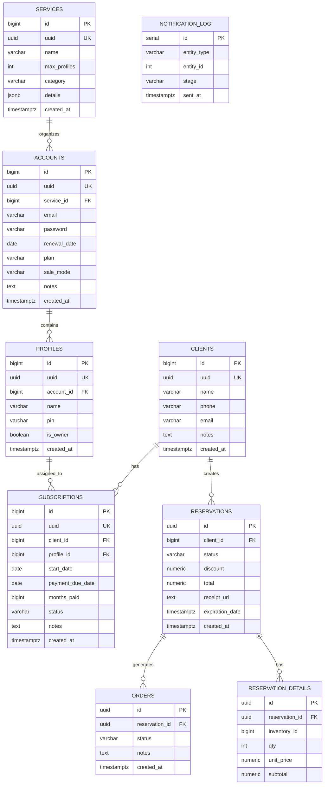

# Neversion — Database Schema

> Fuente de verdad del esquema de base de datos. Refleja el estado real de las migraciones Flyway **V1–V5**.

> ⚠️ **Regla crítica:** El esquema usa Flyway con campos `VARCHAR`. **No existen enums a nivel de base de datos.** Los enums del código Java (v1) están deprecados — no usarlos como referencia para migraciones ni queries. Los valores de estado se almacenan como strings `varchar`.

---

## Migraciones aplicadas

| Versión | Descripción |
|---|---|
| **V1** | Schema unificado base: services, accounts, profiles, clients, subscriptions, reservations, orders |
| **V2** | Vistas de renovación, tabla `notification_log` |
| **V3** | Campo `status` en reservations + tabla `reservation_details` |
| **V4** | Secuencias IDENTITY para PKs BIGINT (requerido por `GenerationType.IDENTITY` de JPA) |
| **V5** | Campo `category` en `services` para filtrado del dashboard |

---

## Patrón de IDs — Doble identificador

Todas las tablas con PK `BIGINT` siguen el mismo patrón:

| Columna | Tipo | Rol |
|---|---|---|
| `id` | `BIGINT` (secuencia) | Clave primaria **interna** — usar en JOINs y FKs |
| `uuid` | `UUID` (gen_random_uuid()) | Identificador **externo** — expuesto en el API REST |

> Las tablas `reservations`, `orders` y `reservation_details` usan directamente `UUID` como PK sin columna `uuid` separada.

---

## Diagrama Entidad-Relación



---

## Tablas — Detalle completo

### `services` — Catálogo de plataformas

La plataforma digital ofrecida (ej. Netflix, Spotify). Anchor point del catálogo. Agregado en V5: campo `category`.

| Campo | Tipo | Notas |
|---|---|---|
| `id` | `BIGINT` PK | Generado por secuencia (V4) |
| `uuid` | `UUID` UK | Expuesto en API. `DEFAULT gen_random_uuid()` |
| `name` | `VARCHAR(150)` NOT NULL UNIQUE | Nombre único de la plataforma |
| `max_profiles` | `INT` NOT NULL | Límite de perfiles por cuenta |
| `category` | `VARCHAR(50)` NOT NULL DEFAULT `'STREAMING'` | Para filtrado del dashboard (`CategoryType`) |
| `details` | `JSONB` | Metadata flexible: pricing tiers, moneda, etc. |
| `created_at` | `TIMESTAMPTZ` NOT NULL DEFAULT `now()` | |

---

### `accounts` — Cuentas maestras

Credenciales compradas al proveedor mayorista.

| Campo | Tipo | Notas |
|---|---|---|
| `id` | `BIGINT` PK | Generado por secuencia (V4) |
| `uuid` | `UUID` UK | Expuesto en API |
| `service_id` | `BIGINT` FK → `services.id` | |
| `email` | `VARCHAR(255)` NOT NULL | Credencial del proveedor |
| `password` | `VARCHAR(255)` NOT NULL | Plaintext — credencial de reventa |
| `renewal_date` | `DATE` NOT NULL | Fecha de pago al mayorista |
| `plan` | `VARCHAR(100)` | Tier de calidad (ej. "4K Ultra HD") |
| `sale_mode` | `VARCHAR(20)` NOT NULL DEFAULT `'by_profile'` | `by_profile` o `full_account` |
| `notes` | `TEXT` | Notas internas del admin |
| `created_at` | `TIMESTAMPTZ` NOT NULL DEFAULT `now()` | |

**Índices:** `idx_accounts_uuid`, `idx_accounts_service`, `idx_accounts_renewal`

---

### `profiles` — Perfiles (subdivisiones de cuenta)

| Campo | Tipo | Notas |
|---|---|---|
| `id` | `BIGINT` PK | Generado por secuencia (V4) |
| `uuid` | `UUID` UK | Expuesto en API |
| `account_id` | `BIGINT` FK → `accounts.id` ON DELETE CASCADE | |
| `name` | `VARCHAR(100)` NOT NULL | Nombre en la plataforma |
| `pin` | `VARCHAR(20)` | PIN de seguridad |
| `is_owner` | `BOOLEAN` NOT NULL DEFAULT `false` | Perfil con privilegios admin en la plataforma |
| `created_at` | `TIMESTAMPTZ` NOT NULL DEFAULT `now()` | |

---

### `clients` — Clientes (consumidores finales)

Reemplaza `users_guests`. Identificador principal para automatizaciones n8n.

| Campo | Tipo | Notas |
|---|---|---|
| `id` | `BIGINT` PK | Generado por secuencia (V4) |
| `uuid` | `UUID` UK | Expuesto en API |
| `name` | `VARCHAR(255)` NOT NULL | |
| `phone` | `VARCHAR(30)` | Canal WhatsApp para notificaciones |
| `email` | `VARCHAR(255)` | |
| `notes` | `TEXT` | Notas internas |
| `created_at` | `TIMESTAMPTZ` NOT NULL DEFAULT `now()` | |

---

### `subscriptions` — Suscripciones

Vínculo activo Cliente ↔ Perfil. `payment_due_date` es el campo crítico monitoreado por n8n.

| Campo | Tipo | Notas |
|---|---|---|
| `id` | `BIGINT` PK | Generado por secuencia (V4) |
| `uuid` | `UUID` UK | Expuesto en API |
| `client_id` | `BIGINT` FK → `clients.id` | |
| `profile_id` | `BIGINT` FK → `profiles.id` | |
| `start_date` | `DATE` NOT NULL DEFAULT `CURRENT_DATE` | |
| `payment_due_date` | `DATE` NOT NULL | Monitoreado por automatizaciones |
| `months_paid` | `BIGINT` NOT NULL DEFAULT `1` | |
| `status` | `VARCHAR(20)` NOT NULL DEFAULT `'active'` | Ver valores abajo |
| `notes` | `TEXT` | Notas del admin |
| `created_at` | `TIMESTAMPTZ` NOT NULL DEFAULT `now()` | |

**Valores de `status`:**

| Valor | Descripción |
|---|---|
| `active` | Acceso vigente |
| `pending` | Esperando pago para renovar |
| `suspended` | Acceso bloqueado por falta de pago (reversible) |
| `cancelled` | Acceso bloqueado por decisión del cliente (irreversible) |

**Constraint de exclusividad:**
```sql
CONSTRAINT unique_active_profile UNIQUE (profile_id, status) DEFERRABLE INITIALLY DEFERRED
```
Garantiza que un perfil no puede tener dos suscripciones en el mismo estado simultáneamente.

**Índices:** `idx_subscriptions_uuid`, `idx_subscriptions_client`, `idx_subscriptions_profile`, `idx_subscriptions_payment_due_date`

---

### `notification_log` — Log de notificaciones (V2)

Auditoría de eventos enviados por n8n.

| Campo | Tipo | Notas |
|---|---|---|
| `id` | `SERIAL` PK | Auto-incremental estándar |
| `entity_type` | `VARCHAR(20)` NOT NULL | `'subscription'` o `'account'` |
| `entity_id` | `INT` NOT NULL | ID del registro notificado |
| `stage` | `VARCHAR(20)` NOT NULL | `'7d'`, `'3d'`, `'1d'`, `'due'`, `'overdue'` |
| `sent_at` | `TIMESTAMPTZ` DEFAULT `NOW()` | |

**Constraint:** `UNIQUE (entity_type, entity_id, stage)` — evita notificaciones duplicadas.

---

### `reservations` — Reservaciones (Storefront)

Estado temporal de checkout. UUID directo como PK (sin columna extra). Campo `status` agregado en V3.

| Campo | Tipo | Notas |
|---|---|---|
| `id` | `UUID` PK DEFAULT `gen_random_uuid()` | |
| `client_id` | `BIGINT` FK → `clients.id` | Nullable (puede vincularse después) |
| `status` | `VARCHAR(20)` NOT NULL DEFAULT `'PENDING'` | Ver flujo en `modules/reservaciones.md` |
| `discount` | `NUMERIC(10,2)` | |
| `total` | `NUMERIC(10,2)` | |
| `receipt_url` | `TEXT` | URL de S3 al comprobante |
| `expiration_date` | `TIMESTAMPTZ` | Auto-expira a los 3600s |
| `created_at` | `TIMESTAMPTZ` NOT NULL DEFAULT `now()` | |

---

### `reservation_details` — Líneas de reservación (V3)

Ítems individuales de una reservación. `subtotal` es una columna generada (no modificable).

| Campo | Tipo | Notas |
|---|---|---|
| `id` | `UUID` PK DEFAULT `gen_random_uuid()` | |
| `reservation_id` | `UUID` FK → `reservations.id` ON DELETE CASCADE | |
| `inventory_id` | `BIGINT` | Referencia al ítem del catálogo (sin FK formal aún) |
| `qty` | `INT` NOT NULL | |
| `unit_price` | `NUMERIC(10,2)` NOT NULL DEFAULT `0` | |
| `subtotal` | `NUMERIC(10,2)` GENERATED ALWAYS AS `(qty * unit_price)` STORED | No se escribe directamente |

---

### `orders` — Órdenes (Storefront)

Registro permanente creado al validar una reservación.

| Campo | Tipo | Notas |
|---|---|---|
| `id` | `UUID` PK DEFAULT `gen_random_uuid()` | |
| `reservation_id` | `UUID` FK → `reservations.id` | |
| `status` | `VARCHAR(20)` NOT NULL DEFAULT `'PENDING'` | `PENDING`, `COMPLETED`, `REJECTED`, `CANCELLED` |
| `notes` | `TEXT` | Notas del admin al validar |
| `created_at` | `TIMESTAMPTZ` NOT NULL DEFAULT `now()` | |

---

## Vistas de BD (V2)

### `upcoming_renewals`
Alimenta el workflow de automatización de n8n para renovaciones de suscripciones de clientes.

```sql
-- Retorna: subscription_id, client_name, client_phone, client_email,
--          service_name, account_email, profile_name,
--          payment_due_date, status, months_paid, days_until_due
-- Filtra: status IN ('active', 'pending')
```

### `upcoming_account_renewals`
Alertas de renovación de cuentas maestras (lo que Neversion paga al mayorista).

```sql
-- Retorna: id, service_name, email, renewal_date, days_until_due
-- Filtra: renewal_date >= CURRENT_DATE - 7 días
```

---

## Cuándo leer este archivo

- Antes de escribir una migración Flyway
- Al implementar queries, repositorios JPA o projections
- Para verificar tipos de datos exactos antes de definir `@Column`

**Ver también:** [`modules/`](../modules/) para reglas de negocio, [`system/api-conventions.md`](api-conventions.md) para contratos REST.
