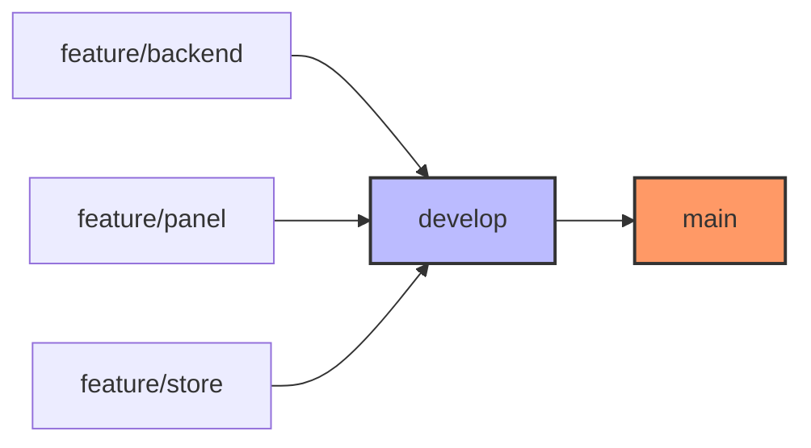

# Agent Coordinator — Project Orchestration

This file serves as the **Single Source of Truth** for AI agents participating in the development of this platform. It defines the global governance, behavioral boundaries, and technical constraints required to maintain system integrity across multiple specialized agents.

> [!IMPORTANT]
> **Zero Guesswork Policy**: Agents are prohibited from making product, business, or architectural decisions. If a requirement is undocumented or ambiguous, you must stop and report immediately.

---

## Mandatory Session Start — Backend Agent (Claude)

**If you are Claude and you are working on `/apps/api`**, your very first action in every new session — before reading anything else, before writing any code, before answering — must be:

```
1. Read: /home/alexavers/projects/neversion/docs/agents/CLAUDE.md
2. Follow the protocol defined there exactly.
```

This file contains your operational protocol (bitácora-first orientation, selective doc reading, structured planning, module-by-module test gates). Skipping it means operating without memory of past decisions.

---

## Project Architecture

```text
root/
├── apps/
│   ├── api/       # Backend   — Spring Boot
│   ├── panel/     # Admin UI  — Angular
│   └── store/     # Client UI — Angular
├── docs/          # Knowledge Base (Read-Only)
└── agents/        # Agent Specs
    ├── AGENTS.md  # Global Entry Point (This File)
    ├── CLAUDE.md  # Backend Agent Protocol
    └── GEMINI.md  # Frontend Agent Protocol
```

---

## Agent Registry & Assignments

| Agent Role | Primary Tool | Target Path | Active Branch | Protocol File |
| :--- | :--- | :--- | :--- | :--- |
| **Backend Architect** | Claude Code | `/apps/api` | `feature/backend` | `agents/CLAUDE.md` |
| **Admin UI Expert** | Gemini / Any | `/apps/panel` | `feature/panel` | `agents/GEMINI.md` |
| **Client UI Expert** | Gemini / Any | `/apps/store` | `feature/store` | `agents/GEMINI.md` |

---

## Mandatory Workflow (The Pipeline)

To ensure API-first consistency, development follows a strictly sequential module-based order:

1.  **Backend Phase**: Backend agent completes the module logic in `feature/backend`.
2.  **Human Gate**: Code review and merge into `develop`.
3.  **Frontend Phase**: UI agents begin implementation in `feature/panel` and `feature/store`.
4.  **Integration**: Final human review and merge into `develop`.
5.  **Cycle**: Proceed to the next module.

---

## Global Operational Rules

### 1. Scope & Boundaries
- **Strict Isolation**: Work exclusively within your assigned project directory.
- **Env Files Forbidden**: Agents must NEVER read, access, or modify any `.env` file under any circumstances. If environmental variables are needed, instruct the user to configure them.
- **Read-Only Docs**: The `/docs` folder is immutable for agents, **except for the implementation logs** in `/docs/implementation/`.
- **Mandatory Logging**: Every change, decision, or progress made must be registered in the corresponding bitácora file within `/docs/implementation/`.
- **No Cross-Talk**: Never modify files belonging to another agent's project scope.

### 2. Database Governance
- **Backend Only**: Schema migrations (Flyway) are exclusive to the Backend Agent.
- **No Direct Access**: No agent shall access the database directly via CLI or raw drivers.
- **Interface Only**: Frontend agents must consume data strictly through the API.

### 3. Code & Language Standards
- **Development Language**: All code, comments, and internal logs must be in **English**.
- **User Interface**: Labels, placeholders, and user-facing messages must be in **Spanish**.
- **Domain Accuracy**: Terminology must align 100% with the Domain Glossary.

### 4. Module Gate — No False Positives (ALL AGENTS — NON-NEGOTIABLE)

Each module (one US) must be validated with tests **before** moving to the next module.

- After completing a module, **stop** and explicitly request the user to run the relevant tests.
- Do **not** proceed to the next module until the user confirms tests are green.
- If tests fail, fix them and re-request before continuing.

**Signature change protocol (Backend Agent):** Whenever a public API signature changes
(use case interface method, service constructor, repository port method), the agent MUST:
1. Run `grep -r "ClassName" src/test --include="*.java" -l` to find all test callers.
2. Update every file returned **before** declaring the module done.
3. Run `./mvnw test -Dtest="AffectedUT,AffectedIT"` — not just `./mvnw compile`.

> [!CAUTION]
> `./mvnw compile` compiles ONLY `src/main`. It does NOT compile or run `src/test`.
> A green compile is NOT confirmation a module works — it is a **false positive**.
> The user discovering test failures the agent should have caught is a **protocol failure**.


---

## Command Constraints

### Allowed Commands
```bash
# Dependency Management
pnpm install
mvn dependency:resolve

# Validation & Testing
mvn test                        # Unit tests (Backend)
mvn verify                      # Integration tests (Backend)
pnpm run test                   # Unit tests (Frontend)
pnpm run test -- --watch=false  # CI execution

# Version Control
git switch -c <branch_name>
git pull | git add | git commit | git push
```

### Forbidden Commands
> [!CAUTION]
> Never execute the following. If a task seems to require them, stop and report.

- **Runtime**: `mvn spring-boot:run`, `pnpm start`, `ng serve`, `docker-compose up`.
- **System**: `pnpm install -g`, `pip install`, `apt install`.
- **DB Raw**: `psql`, `liquibase`, `flyway migrate` (unless explicitly stated for backend).
- **Destructive**: `rm -rf`, `DROP TABLE`, `git push --force`, `git reset --hard`.

---

## Escalation Protocol (Blockers)

If you encounter missing information, conflicting docs, or a technical wall, output the following exactly:

```text
BLOCKER: [Module Name] — [Scope: API | Panel | Store]
Reason: [Clear description of the gap or forbidden requirement]
Reference: [Target documentation file that requires update]
Action Required: Human intervention needed for resolution.
```

---

## Human Responsibility (Integration)

Agents are contributors, not integrators. The human operator is responsible for:
- Branch merges (`develop` ➔ `main`).
- Cross-agent conflict resolution.
- Final validation of business logic alignment.


