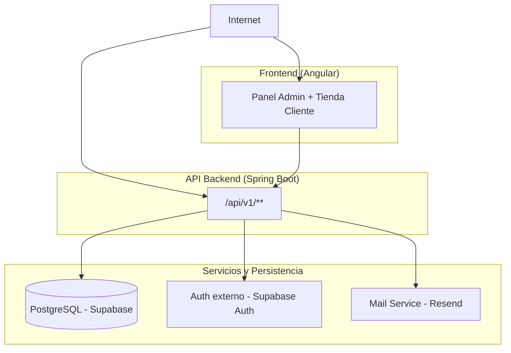

# Deployment

## Topología del sistema

---

## Componentes

### Panel Admin + Tienda Cliente (Angular)
- Aplicación SPA compilada como estático.
- **Hosting recomendado:** Cloudflare Pages.
- Consume el API backend vía HTTP.
- Dos contextos en una sola app: panel del vendedor y tienda del cliente.

### API Backend (Spring Boot)
- Desplegado en **AWS EC2**.
- Contenedor Docker publicado en **AWS ECR**.
- Expone REST API bajo `/api/v1/`.
- Incluye **Actuator** para health checks.
- Documentación **OpenAPI** disponible en ambiente de desarrollo.

### PostgreSQL (Supabase)
- Base de datos principal.
- Migraciones gestionadas con **Flyway desde el backend.
- Acceso solo desde el backend — nunca directo desde el frontend.

### Auth externo (Supabase Auth)
- Proveedor de identidad integrado con Supabase.
- Emite tokens **JWT** que el backend valida.
- El backend mantiene control de roles y permisos internamente (**RBAC implícito**).

### Mail Service (Resend)
- Servicio de correo transaccional.
- Triggered desde el backend en eventos de negocio definidos.
- Todo envío queda registrado en `notification_log`.

---

## Ambientes

| Ambiente | Propósito | Infraestructura |
| :--- | :--- | :--- |
| **local** | Desarrollo individual | Docker local / DB local |
| **develop** | Integración y pruebas | AWS Develop / Supabase Dev |
| **production** | Operación real | AWS Prod / Supabase Prod |

---

## Flujo de despliegue
`feature/xxx` → `develop` → `main` → `production`

- Cada agente trabaja en su propia rama `feature/`.
- Integración obligatoria en `develop` antes de tocar `main`.
- `main` refleja siempre el estado actual de producción.