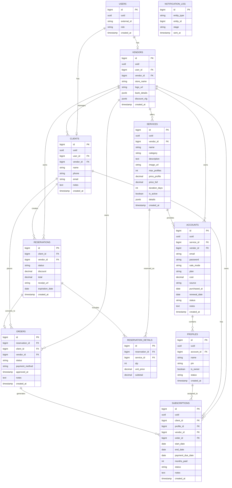

# E-R Diagram

## Notas de Esquema

### Estructura de `discount_cfg` (JSONB) en VENDORS
```json
{
  "min_items": 2,
  "tiers": [
    { "from": 2, "to": 3, "discount_pct": 5 },
    { "from": 4, "to": null, "discount_pct": 10 }
  ]
}
```
El descuento se calcula sobre la cantidad total de ítems en el carrito (incluyendo servicios repetidos). Ver BR-13.

---



> [!NOTE]
> Campos de snapshot financiero en `subscriptions` (`service_id`, `sale_mode`, `price_sold`, `discount_applied`) están identificados como candidatos para EPIC-07/KPIs, pero no existen en el esquema backend vigente hasta EPIC-06. Para cuenta completa, `subscriptions.profile_id` apunta al perfil dueño (`is_owner = true`).
