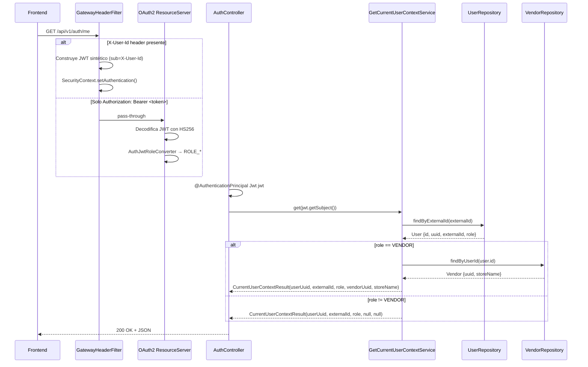

# Auditoría de Seguridad — Estado Actual vs. Gateway Headers

> [!IMPORTANT]
> **Veredicto rápido:** La migración a Gateway headers **ya se implementó parcialmente**. El filtro `GatewayHeaderAuthenticationFilter` existe y está activo, pero coexiste con la validación JWT local via `spring-boot-starter-oauth2-resource-server`. Es un esquema **dual/híbrido**.

---

## 1. ¿`spring-boot-starter-oauth2-resource-server` sigue en el POM?

**Sí.** Ambas dependencias de seguridad siguen presentes en [`pom.xml`](file:///home/alexander/projects/neversion/apps/api/pom.xml#L80-L87):

```xml
<!-- Líneas 80-87 -->
<dependency>
    <groupId>org.springframework.boot</groupId>
    <artifactId>spring-boot-starter-security</artifactId>
</dependency>
<dependency>
    <groupId>org.springframework.boot</groupId>
    <artifactId>spring-boot-starter-oauth2-resource-server</artifactId>
</dependency>
```

Test scope:
```xml
<!-- Líneas 60-64 -->
<dependency>
    <groupId>org.springframework.security</groupId>
    <artifactId>spring-security-test</artifactId>
    <scope>test</scope>
</dependency>
```

No hay dependencias JWT third-party directas (nimbus viene transitivo de oauth2-resource-server). No hay dependencias de Supabase SDK.

---

## 2. ¿Existe un filtro que lea headers tipo X-User-Id?

**Sí.** Existe [`GatewayHeaderAuthenticationFilter.java`](file:///home/alexander/projects/neversion/apps/api/src/main/java/com/neversion/api/config/GatewayHeaderAuthenticationFilter.java):

```java
@Component
@ConditionalOnProperty(name = "neversion.gateway.header-auth.enabled", havingValue = "true", matchIfMissing = true)
public class GatewayHeaderAuthenticationFilter extends OncePerRequestFilter {

    private static final String HEADER_USER_ID = "X-User-Id";
    private static final String HEADER_USER_ROLE = "X-User-Role";
    private static final String HEADER_GATEWAY_SECRET = "X-Gateway-Secret";

    @Value("${neversion.gateway.secret:neversion-secret-gateway-key-change-in-prod}")
    private String expectedGatewaySecret;

    @Value("${neversion.gateway.enforce-secret:false}")
    private boolean enforceGatewaySecret;

    @Override
    protected void doFilterInternal(HttpServletRequest request, HttpServletResponse response,
                                     FilterChain filterChain) throws ServletException, IOException {

        String gatewaySecret = request.getHeader(HEADER_GATEWAY_SECRET);
        if (enforceGatewaySecret && !expectedGatewaySecret.equals(gatewaySecret)) {
            log.warn("Rejected request to {} - missing or invalid X-Gateway-Secret",
                     request.getRequestURI());
            response.sendError(HttpServletResponse.SC_FORBIDDEN,
                               "Forbidden: Invalid Gateway Secret");
            return;
        }

        String userId = request.getHeader(HEADER_USER_ID);
        String userRole = request.getHeader(HEADER_USER_ROLE);

        if (userId != null && !userId.isBlank()) {
            Collection<GrantedAuthority> authorities = new ArrayList<>();
            if (userRole != null && !userRole.isBlank()) {
                String springRole = userRole.startsWith("ROLE_")
                        ? userRole.toUpperCase()
                        : "ROLE_" + userRole.toUpperCase();
                authorities.add(new SimpleGrantedAuthority(springRole));
            }

            // Synthetic JWT for backwards compatibility with @AuthenticationPrincipal Jwt
            Instant now = Instant.now();
            Jwt jwt = new Jwt(
                    "gateway-synthetic-token",
                    now, now.plusSeconds(3600),
                    Map.of("alg", "none"),
                    Map.of(
                        "sub", userId,
                        "role", userRole != null ? userRole : "client",
                        "app_metadata", Map.of("role", userRole != null ? userRole : "client")
                    )
            );

            JwtAuthenticationToken auth = new JwtAuthenticationToken(jwt, authorities, userId);
            SecurityContextHolder.getContext().setAuthentication(auth);
        }

        filterChain.doFilter(request, response);
    }
}
```

> [!NOTE]
> **Puntos clave del filtro:**
> - Está **habilitado por defecto** (`matchIfMissing = true`) — incluso sin configurar `neversion.gateway.header-auth.enabled`, el filtro se registra.
> - **No lee `X-Vendor-Id`** — solo `X-User-Id` y `X-User-Role`.
> - La verificación del `X-Gateway-Secret` está **deshabilitada por defecto** (`enforce-secret: false`).
> - Construye un **JWT sintético** para mantener compatibilidad con `@AuthenticationPrincipal Jwt` en todos los controllers existentes.
> - Se ejecuta **antes** de `UsernamePasswordAuthenticationFilter`, y si `X-User-Id` está presente, setea el `SecurityContext` — esto hace que el JWT decoder de OAuth2 **no se ejecute** para ese request (ya hay autenticación).

---

## 3. Configuración de seguridad completa

[`SecurityConfig.java`](file:///home/alexander/projects/neversion/apps/api/src/main/java/com/neversion/api/config/SecurityConfig.java) — completo:

```java
@Configuration
@EnableWebSecurity
public class SecurityConfig {

    @Value("${auth.jwt.secret}")
    private String jwtSecret;

    @Value("${cors.allowed-origins:*}")
    private String allowedOrigins;

    private final AuthJwtRoleConverter authJwtRoleConverter;
    private final MonitoringAwareBearerTokenResolver monitoringAwareBearerTokenResolver;
    private final MonitoringScrapeTokenAuthenticationFilter monitoringScrapeTokenAuthenticationFilter;
    private final GatewayHeaderAuthenticationFilter gatewayHeaderAuthenticationFilter;
    private final List<HttpSecurityCustomizer> securityCustomizers;

    // ... constructor inyecta todo lo anterior ...

    @Bean
    public SecurityFilterChain securityFilterChain(HttpSecurity http) throws Exception {
        http
            .csrf(csrf -> csrf.disable())
            .cors(cors -> cors.configurationSource(corsConfigurationSource()))
            .sessionManagement(session ->
                session.sessionCreationPolicy(SessionCreationPolicy.STATELESS));

        // Filtros pre-auth
        http.addFilterBefore(monitoringScrapeTokenAuthenticationFilter,
                             UsernamePasswordAuthenticationFilter.class);
        http.addFilterBefore(gatewayHeaderAuthenticationFilter,
                             UsernamePasswordAuthenticationFilter.class);

        // Endpoints públicos + actuator
        http.authorizeHttpRequests(auth -> auth
            .requestMatchers("/v3/api-docs/**", "/swagger-ui/**", "/swagger-ui.html").permitAll()
            .requestMatchers("/actuator/health").permitAll()
            .requestMatchers("/actuator/prometheus").access(/* SUPER_ADMIN o SCRAPER */)
            .requestMatchers("/actuator/**").hasRole("SUPER_ADMIN"));

        // Delegación per-module RBAC
        for (HttpSecurityCustomizer customizer : securityCustomizers) {
            customizer.customize(http);
        }

        // Catch-all
        http.authorizeHttpRequests(auth -> auth.anyRequest().authenticated());

        // OAuth2 Resource Server (validación JWT local)
        http.oauth2ResourceServer(oauth2 -> oauth2
            .bearerTokenResolver(monitoringAwareBearerTokenResolver)
            .jwt(jwt -> jwt
                .decoder(jwtDecoder())
                .jwtAuthenticationConverter(authJwtRoleConverter)));

        // Security headers (HSTS, X-Frame-Options, etc.)
        http.headers(/* ... */);

        return http.build();
    }

    @Bean
    public JwtDecoder jwtDecoder() {
        byte[] secretBytes = jwtSecret.getBytes();
        SecretKey secretKey = new SecretKeySpec(secretBytes, "HmacSHA256");
        return NimbusJwtDecoder.withSecretKey(secretKey).build();
    }
}
```

> [!WARNING]
> **Esquema dual**: el `GatewayHeaderAuthenticationFilter` corre primero. Si pone auth en el `SecurityContext`, el `oauth2ResourceServer` la respeta y no valida el JWT del header `Authorization`. Si no hay headers de gateway, se cae al flow normal OAuth2/JWT. Esto implica que **cualquiera que envíe `X-User-Id` puede bypassear la validación JWT** mientras `enforce-secret` esté en `false`.

---

## 4. ¿Cómo se obtiene el usuario autenticado en controllers/services?

**Patrón único: `@AuthenticationPrincipal Jwt jwt` → `jwt.getSubject()`**

Todos los controllers usan exactamente el mismo patrón. Ejemplo de [`VendorController`](file:///home/alexander/projects/neversion/apps/api/src/main/java/com/neversion/api/vendor/infrastructure/adapters/in/rest/controller/VendorController.java#L62-L68):

```java
public ResponseEntity<String> updateDiscountConfig(
        @Valid @RequestBody UpdateDiscountConfigRequest request,
        @AuthenticationPrincipal Jwt jwt) {

    String updated = updateDiscountConfigUseCase.updateDiscountConfig(
            jwt.getSubject(),      // ← externalId (UUID de Supabase)
            request.discountCfg());
    return ResponseEntity.ok(updated);
}
```

Ejemplo de [`AuthController.me()`](file:///home/alexander/projects/neversion/apps/api/src/main/java/com/neversion/api/auth/infrastructure/adapters/in/rest/controller/AuthController.java#L67-L70):

```java
public ResponseEntity<CurrentUserResponse> me(@AuthenticationPrincipal Jwt jwt) {
    CurrentUserContextResult result = getCurrentUserContextUseCase.get(jwt.getSubject());
    return ResponseEntity.ok(CurrentUserResponseMapper.toResponse(result));
}
```

El rol se extrae del JWT por [`AuthJwtRoleConverter`](file:///home/alexander/projects/neversion/apps/api/src/main/java/com/neversion/api/config/AuthJwtRoleConverter.java) — lee `app_metadata.role` del JWT y lo mapea a `ROLE_VENDOR`, `ROLE_CLIENT`, `ROLE_SUPER_ADMIN`:

```java
private String extractRole(Jwt jwt) {
    Map<String, Object> appMetadata = jwt.getClaim("app_metadata");
    if (appMetadata != null && appMetadata.containsKey("role")) {
        return String.valueOf(appMetadata.get("role"));
    }
    return null;
}
```

### Patrón A: `@AuthenticationPrincipal Jwt jwt` → `jwt.getSubject()`

- [`AuthController`](file:///home/alexander/projects/neversion/apps/api/src/main/java/com/neversion/api/auth/infrastructure/adapters/in/rest/controller/AuthController.java) — `me()`
- [`GameController`](file:///home/alexander/projects/neversion/apps/api/src/main/java/com/neversion/api/game/infrastructure/adapters/in/rest/controller/GameController.java) — 5 endpoints
- [`GameSkuController`](file:///home/alexander/projects/neversion/apps/api/src/main/java/com/neversion/api/gamesku/infrastructure/adapters/in/rest/controller/GameSkuController.java) — 5 endpoints
- [`ServiceController`](file:///home/alexander/projects/neversion/apps/api/src/main/java/com/neversion/api/service/infrastructure/adapters/in/rest/controller/ServiceController.java) — 5 endpoints
- [`VendorController`](file:///home/alexander/projects/neversion/apps/api/src/main/java/com/neversion/api/vendor/infrastructure/adapters/in/rest/controller/VendorController.java) — 2 endpoints

### Patrón B: `JwtAuthenticationToken token` → helper `extractExternalId()`

```java
/** Extracts the Supabase externalId (sub claim) from the JWT. */
private String extractExternalId(Principal principal) {
    if (principal instanceof JwtAuthenticationToken jwtToken) {
        return jwtToken.getToken().getSubject();
    }
    throw new IllegalStateException("No JWT principal found in security context");
}
```

- [`AccountController`](file:///home/alexander/projects/neversion/apps/api/src/main/java/com/neversion/api/account/infrastructure/adapters/in/rest/controller/AccountController.java) — 5 endpoints
- [`ClientController`](file:///home/alexander/projects/neversion/apps/api/src/main/java/com/neversion/api/client/infrastructure/adapters/in/rest/controller/ClientController.java) — 10 endpoints
- [`AssignmentController`](file:///home/alexander/projects/neversion/apps/api/src/main/java/com/neversion/api/assignment/infrastructure/adapters/in/rest/controller/AssignmentController.java) — 3 endpoints
- [`OrderController`](file:///home/alexander/projects/neversion/apps/api/src/main/java/com/neversion/api/order/infrastructure/adapters/in/rest/controller/OrderController.java)
- [`SubscriptionController`](file:///home/alexander/projects/neversion/apps/api/src/main/java/com/neversion/api/subscription/infrastructure/adapters/in/rest/controller/SubscriptionController.java)
- [`ReservationController`](file:///home/alexander/projects/neversion/apps/api/src/main/java/com/neversion/api/reservation/infrastructure/adapters/in/rest/controller/ReservationController.java)
- [`NotificationController`](file:///home/alexander/projects/neversion/apps/api/src/main/java/com/neversion/api/notification/infrastructure/adapters/in/rest/controller/NotificationController.java)
- [`ClientPointsController`](file:///home/alexander/projects/neversion/apps/api/src/main/java/com/neversion/api/points/infrastructure/adapters/in/rest/controller/ClientPointsController.java)
- [`VendorClientPointsController`](file:///home/alexander/projects/neversion/apps/api/src/main/java/com/neversion/api/points/infrastructure/adapters/in/rest/controller/VendorClientPointsController.java)

> [!NOTE]
> Ambos patrones son **funcionalmente equivalentes** — extraen `jwt.getSubject()` del `JwtAuthenticationToken`. Ambos funcionan con el JWT sintético del `GatewayHeaderAuthenticationFilter`. No existe uso de `SecurityContextHolder.getContext().getAuthentication()` en controllers/services (solo en los filtros).

---

## 5. Entidad Vendor y relación con usuario autenticado

### Modelo de dominio — [`Vendor.java`](file:///home/alexander/projects/neversion/apps/api/src/main/java/com/neversion/api/vendor/domain/model/Vendor.java)

```java
@Getter
@Builder
public class Vendor {
    private final Long id;
    private final UUID uuid;
    private final Long userId;     // ← FK a users.id
    private final String storeName;
    private final String logoUrl;
    private final String bankDetails;   // JSON opaco
    @Setter private String discountCfg; // JSON opaco (BR-13)
    @Setter private String rewardsCfg;  // JSON opaco
    private final Instant createdAt;
}
```

### Entidad JPA — [`VendorEntity.java`](file:///home/alexander/projects/neversion/apps/api/src/main/java/com/neversion/api/vendor/infrastructure/adapters/out/VendorEntity.java)

```java
@Entity
@Table(name = "vendors")
public class VendorEntity {
    @Id @GeneratedValue(strategy = GenerationType.IDENTITY)
    private Long id;

    @Column(nullable = false, unique = true, updatable = false)
    private UUID uuid;

    @Column(name = "user_id", nullable = false, updatable = false)
    private Long userId;     // FK escalar, sin @ManyToOne (hexagonal)

    @Column(name = "store_name", nullable = false)
    private String storeName;

    @Column(name = "logo_url")
    private String logoUrl;

    @JdbcTypeCode(SqlTypes.JSON)
    @Column(name = "bank_details", columnDefinition = "jsonb")
    private String bankDetails;

    @JdbcTypeCode(SqlTypes.JSON)
    @Column(name = "discount_cfg", columnDefinition = "jsonb")
    private String discountCfg;

    @JdbcTypeCode(SqlTypes.JSON)
    @Column(name = "rewards_cfg", columnDefinition = "jsonb")
    private String rewardsCfg;

    @CreationTimestamp
    @Column(name = "created_at", nullable = false, updatable = false)
    private Instant createdAt;
}
```

### Relación User ↔ Vendor

| Tabla | Columna | Referencia |
|-------|---------|------------|
| `vendors` | `user_id` | → `users.id` (FK en DB, escalar en Java) |
| `accounts` | `vendor_id` | → `vendors.id` |
| `clients` | `vendor_id` | → `vendors.id` |
| `games` | `vendor_id` | → `vendors.id` |
| `game_skus` | `vendor_id` | → `vendors.id` |
| `orders` | `vendor_id` | → `vendors.id` |
| `profiles` | `vendor_id` | → `vendors.id` |
| `services` | `vendor_id` | → `vendors.id` |
| `subscriptions` | `vendor_id` | → `vendors.id` |
| `points_ledger` | `vendor_id` | → `vendors.id` |
| `reservations` | `vendor_id` | → `vendors.id` |

**Flujo de resolución:** `jwt.getSubject()` → `externalId` → lookup en tabla `users` → `user.id` → lookup en tabla `vendors` por `user_id` → obtiene `vendor.id` para filtrar multi-tenant.

---

## 6. ¿application.yml tiene `issuer-uri` o `jwk-set-uri` de Supabase?

**No.** No existe `spring.security.oauth2.resourceserver.jwt.issuer-uri` ni `jwk-set-uri` en ningún perfil.

La validación JWT es con **HS256 + shared secret**, no con JWKS:

### [`application.yaml`](file:///home/alexander/projects/neversion/apps/api/src/main/resources/application.yaml#L25-L29)
```yaml
auth:
  jwt:
    secret: ${AUTH_JWT_SECRET}
  api-url: ${AUTH_API_URL}
  admin-key: ${AUTH_ADMIN_KEY}
```

### [`application-dev.yaml`](file:///home/alexander/projects/neversion/apps/api/src/main/resources/application-dev.yaml#L44-L48)
```yaml
auth:
  jwt:
    secret: ${AUTH_JWT_SECRET:your-dev-jwt-secret}
  api-url: ${AUTH_API_URL:http://localhost:9999}
  admin-key: ${AUTH_ADMIN_KEY:your-dev-service-role-key}
```

### [`application-prod.yaml`](file:///home/alexander/projects/neversion/apps/api/src/main/resources/application-prod.yaml#L55-L59)
```yaml
auth:
  jwt:
    secret: ${AUTH_JWT_SECRET}
  api-url: ${AUTH_API_URL}
  admin-key: ${AUTH_ADMIN_KEY}
```

El `JwtDecoder` se construye manualmente en `SecurityConfig`:
```java
@Bean
public JwtDecoder jwtDecoder() {
    byte[] secretBytes = jwtSecret.getBytes();
    SecretKey secretKey = new SecretKeySpec(secretBytes, "HmacSHA256");
    return NimbusJwtDecoder.withSecretKey(secretKey).build();
}
```

> [!NOTE]
> `auth.api-url` y `auth.admin-key` son para la comunicación server-to-server con Supabase/GoTrue (crear usuarios, etc.), no para validación de JWT entrantes.

---

## 7. Deep-dive: `GET /api/v1/auth/me`

Este endpoint es el **"quién soy yo en la plataforma"** — traduce la identidad de Supabase/Gateway al contexto interno de Neversion.

### RBAC

Definido en [`AuthSecurityConfig`](file:///home/alexander/projects/neversion/apps/api/src/main/java/com/neversion/api/auth/infrastructure/config/AuthSecurityConfig.java#L27-L28):

```java
.requestMatchers(HttpMethod.GET, "/api/v1/auth/me")
.authenticated()   // cualquier rol válido puede llamarlo
```

### Flujo de ejecución



### Service: [`GetCurrentUserContextService`](file:///home/alexander/projects/neversion/apps/api/src/main/java/com/neversion/api/user/application/service/GetCurrentUserContextService.java)

```java
@Service
public class GetCurrentUserContextService implements GetCurrentUserContextUseCase {

    private final UserRepositoryPort userRepositoryPort;
    private final VendorRepositoryPort vendorRepositoryPort;

    @Override
    @Transactional(readOnly = true)
    public CurrentUserContextResult get(String callerExternalId) {
        User user = userRepositoryPort.findByExternalId(callerExternalId)
                .orElseThrow(() -> new ResourceNotFoundException(
                        "User not found for externalId: " + callerExternalId));

        if (user.getRole() != UserRole.VENDOR) {
            return new CurrentUserContextResult(
                    user.getUuid(), user.getExternalId(), user.getRole(),
                    null, null);
        }

        Vendor vendor = vendorRepositoryPort.findByUserId(user.getId())
                .orElseThrow(() -> new ResourceNotFoundException(
                        "Vendor record not found for user: " + user.getUuid()));

        return new CurrentUserContextResult(
                user.getUuid(), user.getExternalId(), user.getRole(),
                vendor.getUuid(), vendor.getStoreName());
    }
}
```

### Response DTO: [`CurrentUserResponse`](file:///home/alexander/projects/neversion/apps/api/src/main/java/com/neversion/api/auth/infrastructure/adapters/in/rest/dto/CurrentUserResponse.java)

```java
public record CurrentUserResponse(
    UUID userUuid,      // UUID público del usuario interno
    String externalId,  // subject de Supabase
    String role,        // "vendor", "client", "super_admin" (lowercase)
    UUID vendorUuid,    // UUID público del vendor (null si no es vendor)
    String storeName    // nombre de tienda (null si no es vendor)
) {}
```

### Ejemplos de response por rol

**VENDOR:**
```json
{
  "userUuid": "a1b2c3d4-e5f6-7890-abcd-ef1234567890",
  "externalId": "supabase-uuid-abc123",
  "role": "vendor",
  "vendorUuid": "x9y8z7w6-v5u4-3210-dcba-fedcba098765",
  "storeName": "Mi Tienda Digital"
}
```

**CLIENT:**
```json
{
  "userUuid": "a1b2c3d4-e5f6-7890-abcd-ef1234567890",
  "externalId": "supabase-uuid-def456",
  "role": "client",
  "vendorUuid": null,
  "storeName": null
}
```

**SUPER_ADMIN:**
```json
{
  "userUuid": "a1b2c3d4-e5f6-7890-abcd-ef1234567890",
  "externalId": "supabase-uuid-ghi789",
  "role": "super_admin",
  "vendorUuid": null,
  "storeName": null
}
```

### Errores posibles

| Código | Causa |
|--------|-------|
| `401` | Sin JWT ni headers de gateway válidos |
| `404` | `externalId` no tiene usuario interno, o es vendor pero falta registro en `vendors` |

> [!WARNING]
> Con gateway headers, si alguien envía un `X-User-Id` que no existe en la tabla `users`, el filtro acepta el request (setea auth) pero el `/me` devuelve 404. No hay validación de existencia en el filtro.

---

## Resumen del estado

| Aspecto | Estado |
|---------|--------|
| `oauth2-resource-server` en POM | ✅ Presente y activo |
| Filtro de Gateway headers | ✅ Implementado (`GatewayHeaderAuthenticationFilter`) |
| Headers leídos | `X-User-Id`, `X-User-Role` (⚠️ NO `X-Vendor-Id`) |
| Gateway secret enforcement | ❌ **Deshabilitado** por defecto |
| `issuer-uri` / `jwk-set-uri` | ❌ No existen — usa HS256 con secret compartido |
| Esquema actual | **Dual/híbrido** — gateway headers tienen prioridad, JWT es fallback |
| Patrones de extracción de identidad | 2 patrones equivalentes en **17 controllers** |
| Endpoint `/me` | Resuelve `externalId` → `User` → `Vendor` (si aplica) |
| Riesgo de seguridad | ⚠️ Con `enforce-secret: false`, cualquier cliente puede spoofear `X-User-Id` |
