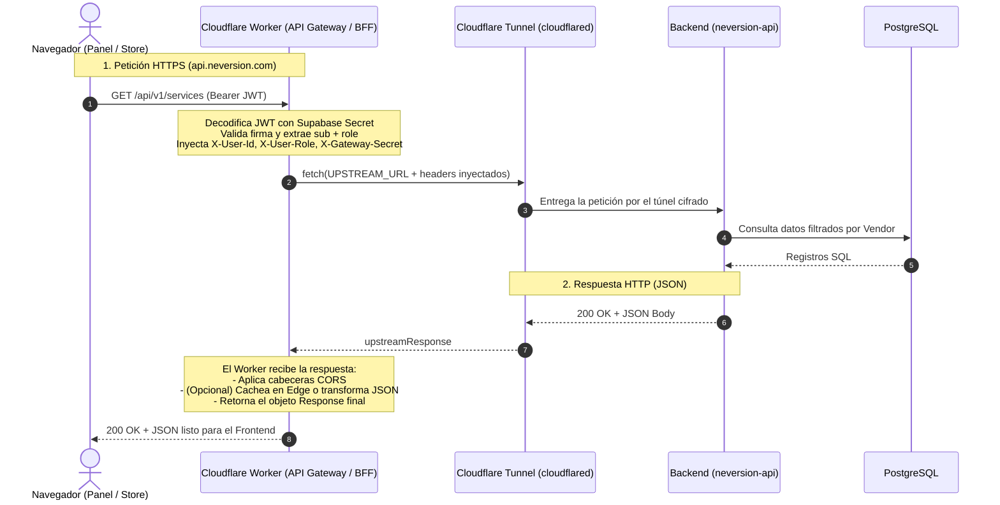

```mermaid
sequenceDiagram
        autonumber
        actor User as Navegador (Panel / Store)
        participant Worker as Cloudflare Worker (API Gateway / BFF)
        participant Tunnel as Cloudflare Tunnel (cloudflared)
        participant Spring as Backend (neversion-api)
        participant DB as PostgreSQL

        %% Flujo de Ida (Request)
        Note over User,Worker: 1. Petición HTTPS (api.neversion.com)
        User->>Worker: GET /api/v1/services (Bearer JWT)
        Note over Worker: Decodifica JWT con Supabase Secret<br/>Valida firma y extrae sub + role<br/>Inyecta X-User-Id, X-User-Role, X-Gateway-Secret

        Worker->>Tunnel: fetch(UPSTREAM_URL + headers inyectados)
        Tunnel->>Spring: Entrega la petición por el túnel cifrado

        Spring->>DB: Consulta datos filtrados por Vendor
        DB-->>Spring: Registros SQL

        %% Flujo de Vuelta (Response)
        Note over Spring,Tunnel: 2. Respuesta HTTP (JSON)
        Spring-->>Tunnel: 200 OK + JSON Body
        Tunnel-->>Worker: upstreamResponse

        Note over Worker: El Worker recibe la respuesta:<br/>- Aplica cabeceras CORS<br/>- (Opcional) Cachea en Edge o transforma JSON<br/>- Retorna el objeto Response final

        Worker-->>User: 200 OK + JSON listo para el Frontend
```
