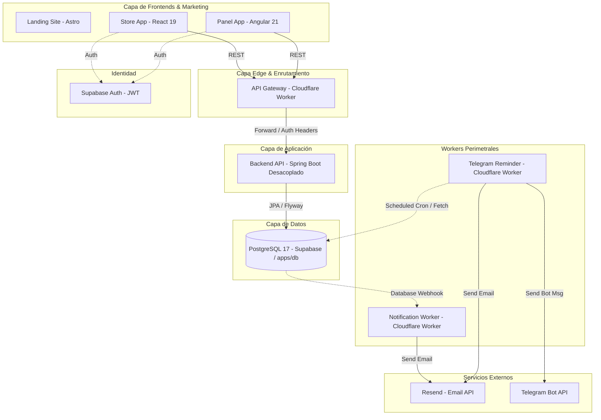

# Arquitectura de Alto Nivel

Este diagrama describe la interacción entre los componentes del monorepo y los servicios externos.

## Componentes
1. **Landing Site (`apps/www`):** Portal comercial y landing pública de Neversion construida con Astro.
2. **Store App (`apps/store`):** Interfaz para el cliente final en React 19 (Catálogo de servicios, carrito, órdenes y accesos).
3. **Panel App (`apps/panel`):** Interfaz administrativa para Vendedores y Super Admin en Angular 21 (Inventario, cuentas, perfiles, clientes y asignaciones).
4. **API Gateway (`apps/api-gateway`):** Cloudflare Worker que gestiona CORS, pre-validación de tokens JWT y balanceo perimetral.
5. **Supabase Auth:** Proveedor de identidad externo que emite los JWTs de usuario.
6. **Backend API:** Núcleo de lógica de negocio y persistencia relacional (desacoplado).
7. **Notification Worker (`apps/notification-worker`):** Cloudflare Worker reactivo a eventos/webhooks de base de datos para envío de emails mediante Resend.
8. **Telegram Reminder (`apps/telegram-reminder`):** Cloudflare Worker para alertas interactivas de renovación vía Telegram Bot y recordatorios por email.
9. **PostgreSQL 17 (`apps/db` / Supabase):** Base de datos relacional multi-tenant.

