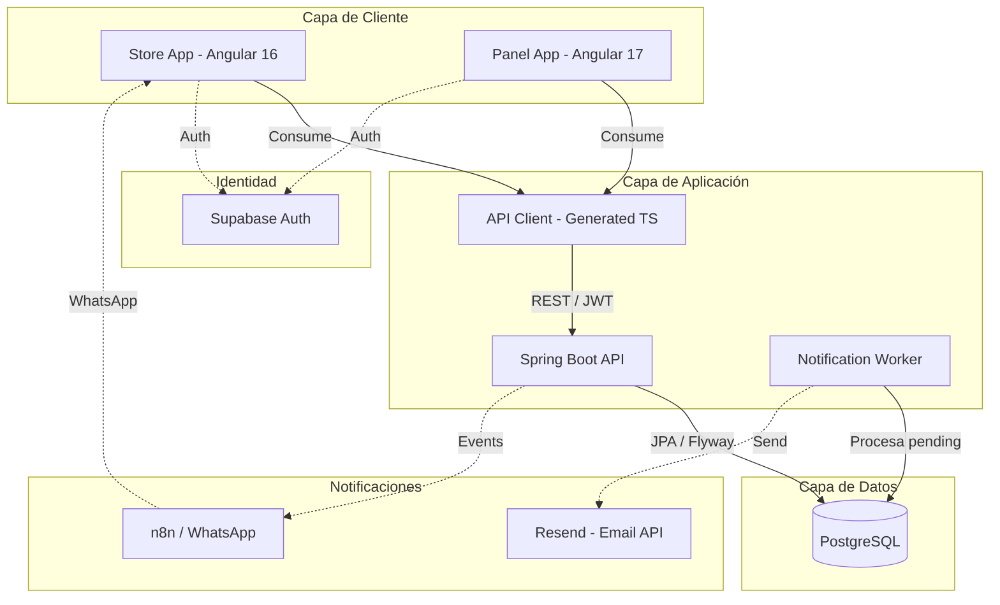

# Arquitectura de Alto Nivel

Este diagrama describe la interacción entre los componentes del monorepo y los servicios externos.

## Componentes
1.  **Store App:** Interfaz para el cliente final (Catálogo, Carrito, Mis Accesos).
2.  **Panel App:** Interfaz administrativa para Vendedores (Inventario, Órdenes, Clientes).
3.  **Supabase Auth:** Gestiona la autenticación externa y provee el `externalId` (UUID).
4.  **Spring Boot API:** Núcleo del sistema (Reglas de negocio, Hexagonal Architecture).
5.  **Notification Worker:** Proceso interno que consume `notification_log` (PENDING) y envía correos vía Resend (EPIC-08).
6.  **Resend:** Servicio externo de envío de correos transaccionales.
7.  **API Client:** Paquete compartido que garantiza contratos tipados entre el backend y los frontends.
8.  **n8n:** Orquestador de notificaciones externas (WhatsApp).

