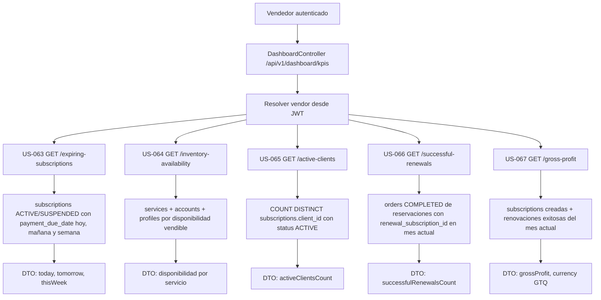

# KPIs del Vendedor (EPIC-10)

Este diagrama resume los endpoints backend de KPIs del vendedor autenticado. Todos resuelven el `vendorId` desde el JWT y no aceptan identificadores de vendedor en el request.

## Reglas

1. Solo `ROLE_VENDOR` puede consultar `/api/v1/dashboard/kpis/**`.
2. `SUPER_ADMIN` no accede a estos KPIs porque el alcance confirmado para EPIC-10 es vendedor autenticado.
3. El período financiero predeterminado es el mes calendario actual calculado en backend.
4. La ganancia bruta usa snapshots financieros de `subscriptions`: `price_sold - discount_applied`.
