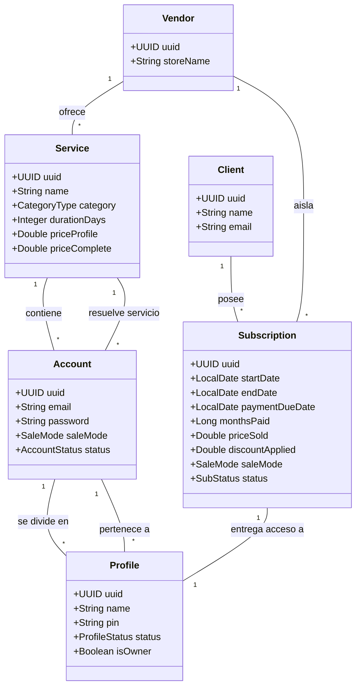

# Modelo de Dominio e Inventario

Este diagrama describe las relaciones jerárquicas del inventario y el ciclo de vida de los recursos (EPIC-02 y EPIC-03).

## Reglas de Negocio Clave
1.  **Multi-tenancy:** Casi todas las entidades (`Service`, `Account`, `Client`, `Subscription`) pertenecen a un `Vendor`. El aislamiento se garantiza por `vendorId`.
2.  **Jerarquía de Inventario:** Un `Service` (ej: Netflix) tiene múltiples `Account` (cuentas maestras). Cada cuenta tiene un cupo limitado de `Profile` (perfiles individuales).
3.  **Estados de Perfil:**
    *   `AVAILABLE`: Listo para ser asignado.
    *   `ACTIVE`: Asignado a una suscripción vigente.
    *   `BLOCKED`: Bloqueado manualmente por el vendedor.
    *   `EXPIRED`: La suscripción asociada ha vencido.
4.  **Listado de Suscripciones (EPIC-07 / US-043):** El panel lista suscripciones por `Vendor`, filtra por estado y servicio, y ordena por `paymentDueDate` ascendente.
5.  **Snapshots Financieros (EPIC-07 / US-044):** Cada `Subscription` conserva `serviceId`, `priceSold`, `discountApplied` y `saleMode` para detalle histórico y KPIs sin depender de cambios futuros del catálogo.
6.  **Renovación BR-07 (EPIC-07 / US-045):** Renovar incrementa `monthsPaid`, recalcula `paymentDueDate/endDate` desde la fecha original o desde el pago según la gracia configurada, y restaura inventario activo.
7.  **Revocación (EPIC-07 / US-046):** Revocar cancela la `Subscription` y libera el inventario: perfil `AVAILABLE` para `BY_PROFILE`, o todos los perfiles y cuenta `AVAILABLE` para `FULL_ACCOUNT`.
8.  **Vencimiento Automático (EPIC-07 / US-047):** El scheduler suspende suscripciones activas vencidas y mueve el inventario a `EXPIRED`; la renovación posterior puede reactivar el acceso.
9.  **Creación Manual (EPIC-07 / US-048):** El vendedor puede crear una `Subscription` sin `Order`; el sistema valida ownership, disponibilidad, modalidad real de la cuenta y registra snapshots financieros.
