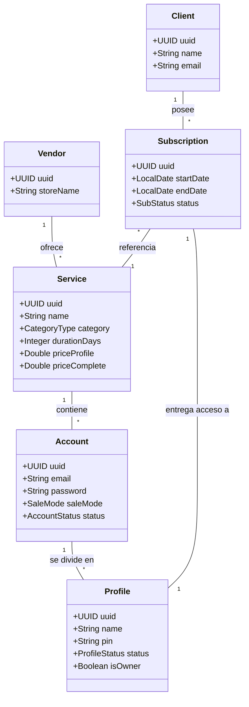

# Modelo de Dominio e Inventario

Este diagrama describe las relaciones jerárquicas del inventario y el ciclo de vida de los recursos (EPIC-02 y EPIC-03).

## Reglas de Negocio Clave
1.  **Multi-tenancy:** Casi todas las entidades (`Service`, `Account`, `Client`, `Subscription`) pertenecen a un `Vendor`. El aislamiento se garantiza por `vendorId`.
2.  **Jerarquía de Inventario:** Un `Service` (ej: Netflix) tiene múltiples `Account` (cuentas maestras). Cada cuenta tiene un cupo limitado de `Profile` (perfiles individuales).
3.  **Estados de Perfil:**
    *   `AVAILABLE`: Listo para ser asignado.
    *   `ACTIVE`: Asignado a una suscripción vigente.
    *   `BLOCKED`: Bloqueado manualmente por el vendedor.
    *   `EXPIRED`: La suscripción asociada ha vencido.
