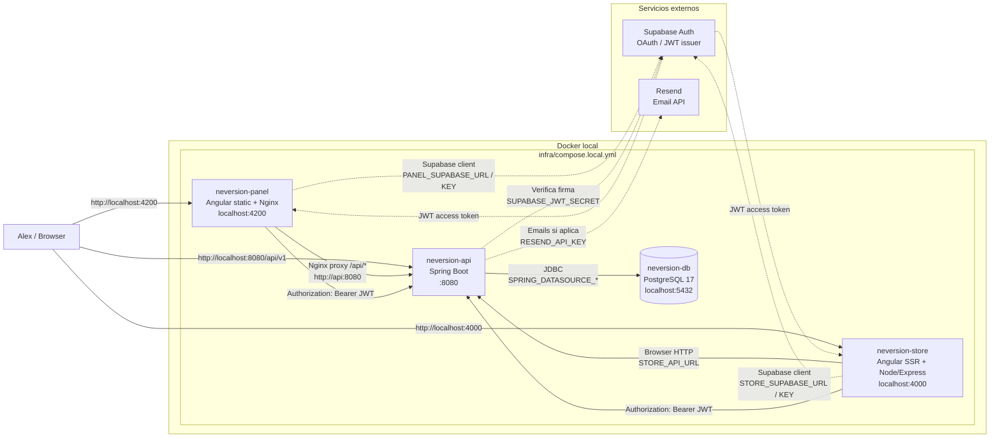

# Runtime Local Con Docker Compose

Este diagrama describe como interactuan los contenedores cuando se levanta el stack local desde `infra/compose.local.yml`.



## Puntos Clave

- `db`, `api`, `panel` y `store` corren dentro de la misma red Docker Compose.
- La API usa `SPRING_DATASOURCE_URL=jdbc:postgresql://db:5432/neversiondb` para conectarse al PostgreSQL local.
- El panel es estatico y Nginx sirve los assets; tambien proxya `/api/*` hacia `http://api:8080`.
- El store es SSR y corre con el servidor Node/Express generado por Angular Universal.
- Los frontends usan `runtime-config.js`, generado al arrancar el contenedor, para leer URLs y keys desde variables de entorno.
- Supabase Auth se usa para autenticacion; la API valida tokens con `SUPABASE_JWT_SECRET`.
- En produccion la topologia cambia: API, panel y store se despliegan por separado en Dokploy, y la base de datos real se configura con `SPRING_DATASOURCE_*`.

## Comando Local

```bash
cp infra/.env.example infra/.env
docker compose --env-file infra/.env -f infra/compose.local.yml up --build
```
