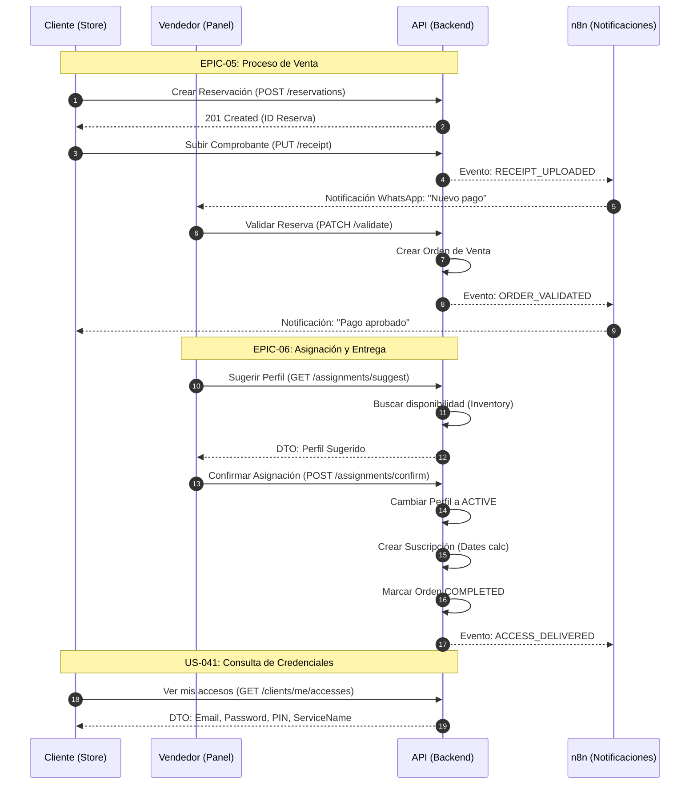

# Flujo Crítico: Compra, Validación y Entrega

Este diagrama de secuencia detalla el proceso completo desde que un cliente inicia una compra hasta que recibe sus credenciales (completado en EPIC-06).

## Estados de la Orden
*   **PENDING:** Reservación creada, esperando comprobante.
*   **UPLOADED:** Comprobante enviado, esperando revisión del vendedor.
*   **VALIDATED:** Pago aprobado, lista para asignar perfiles.
*   **COMPLETED:** Perfiles asignados y credenciales entregadas.
*   **REJECTED / CANCELLED:** Flujos de excepción por pago inválido o expiración.
