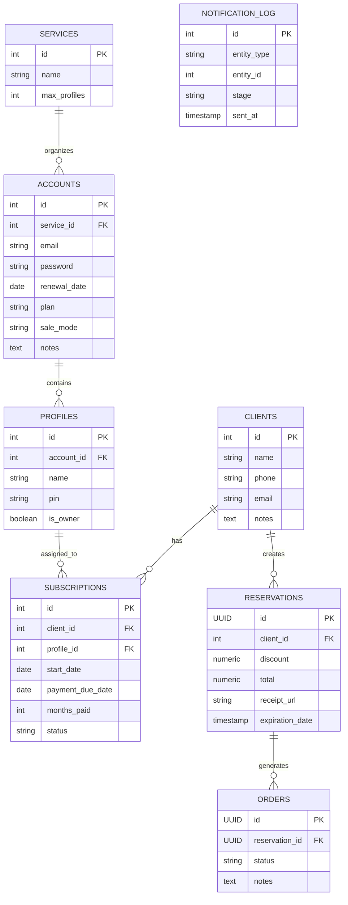

# Architecture Design - Entity Relationship Diagram

This diagram represents the unified data model for the Neversion system (Sprint 1.5). It merges the flexible layout from the new automation database while retaining the essential components for storefront features (such as Reservations and Orders).

## Entity Descriptions

- **SERVICES**: Specific platforms offered (e.g., Netflix, Disney+, Spotify).
- **ACCOUNTS**: The physical master credentials purchased from a third-party wholesale provider to operate a service.
- **PROFILES**: Direct physical sub-divisions of an Account (formerly known as "Slots"). 
- **CLIENTS**: The consumers paying for profiles. Replaces the legacy "Users Guests".
- **SUBSCRIPTIONS**: The core relationship between a Client and a specific Profile, controlling their access window and payment dates.
- **NOTIFICATION_LOG**: Used by async jobs (n8n) to track notification stages (e.g., generated emails for renewals).
- **RESERVATIONS & ORDERS**: Used primarily for storefront workflow (Phase 3). Contains payment receipts and temporary checkout state.
