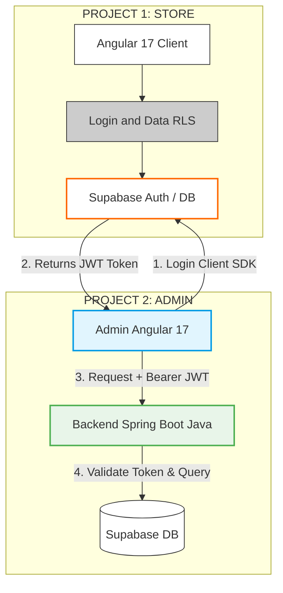

# Backend and Frontend Interoperability Diagram

This flowchart outlines the authentication and communication structure for the Neversion system, separating the customer-facing Store from the protected Admin management system.

## Communication Steps

1.  **Login Client SDK**: The Admin Panel uses the Supabase SDK to authenticate against the primary Supabase Auth instance.
2.  **Returns JWT Token**: Supabase provides a JSON Web Token (JWT) upon successful authentication.
3.  **Request + Bearer JWT**: The Admin Panel sends API requests to the Java Spring Boot Backend, including the JWT in the `Authorization` header.
4.  **Validate Token & Query**: The Backend validates the token via Supabase's JWKS and proceeds to perform authorized queries on the database.
