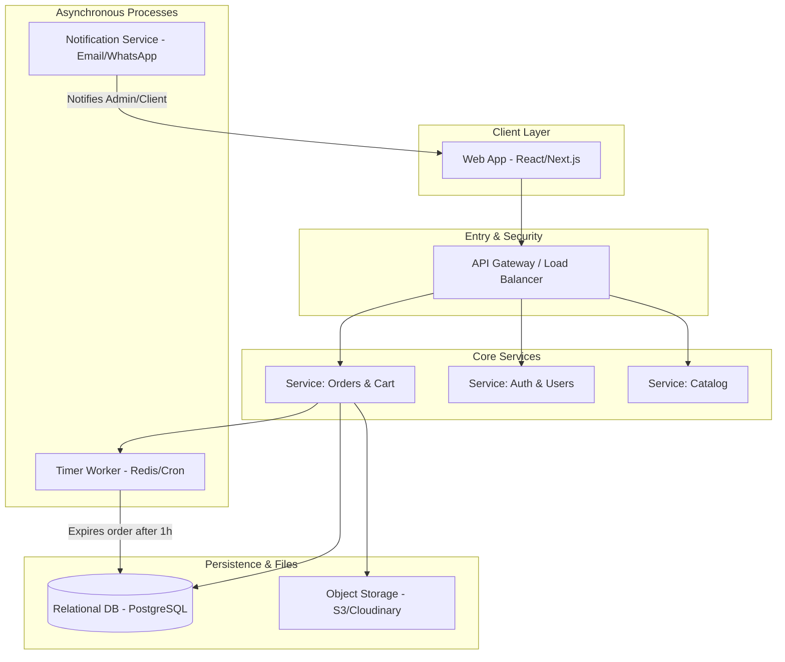

# High-Level Architecture Overview

This diagram provides a high-level view of the decoupled, microservice-ready architecture used by the Neversion system.

## Architectural Components

- **Client Layer**: Modern web frontend using React/Next.js, providing a dynamic shopping experience.
- **API Gateway**: Acts as the single point of entry, handling authentication, load balancing, and routing.
- **Core Services**: Decoupled modules managing specialized domain logic for catalogs, users, and orders.
- **Persistence & Files**: Secure storage for relational data in PostgreSQL and media assets in Object Storage (S3).
- **Asynchronous Processes**: Handles background tasks such as order expiration timers and real-time notifications via Email or messaging.
