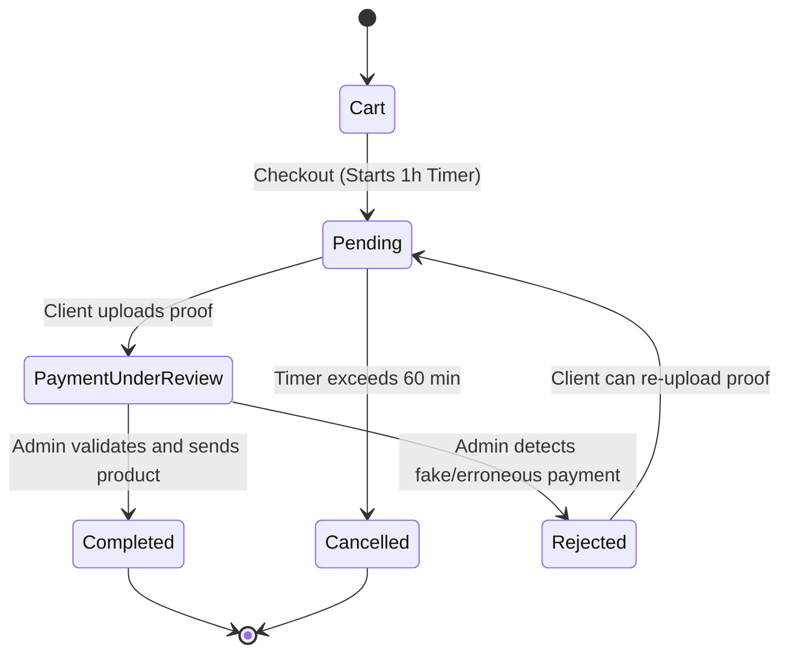

# Order Lifecycle - State Machine

This state diagram defines the checkout process, the payment validation workflow, and the automated order cancellation timer.

## State Definitions & Transitions

- **Cart**: The initial active state where a user selects their products.
- **Pending**: Triggers upon checkout, initializing a 60-minute countdown for payment submission.
- **PaymentUnderReview**: Occurs after a client uploads their payment confirmation, awaiting manual admin verification.
- **Completed**: The "Success" state where the order is fulfilled and products are sent digitally.
- **Rejected**: If payment validation fails, the user is given another opportunity to upload the correct proof.
- **Cancelled**: If the 1-hour window closes before a payment is submitted, the system automatically terminates the order to free up slots/inventory.
