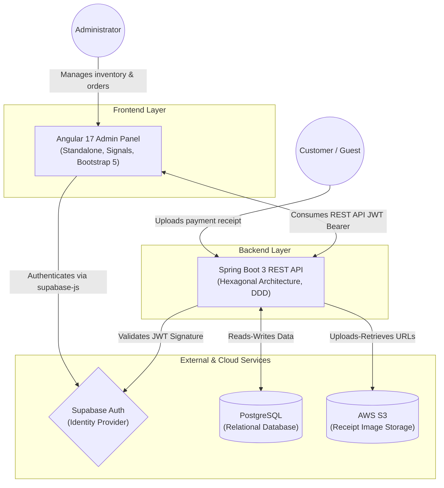
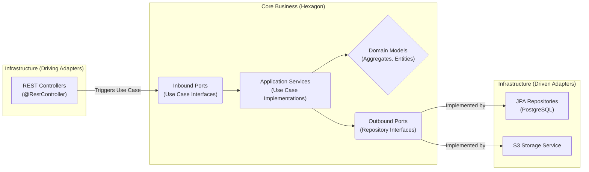
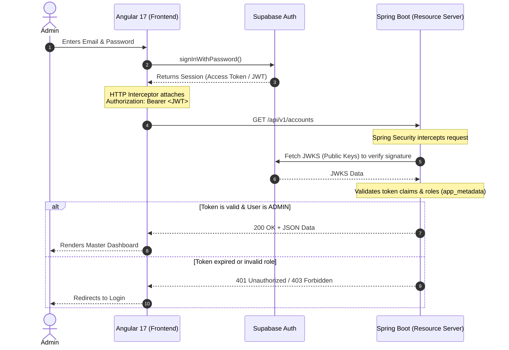

# 2. System Architecture

This document outlines the high-level architecture, design patterns, and interaction flows between the different components of the system.

## 2.1. High-Level System Context

The system follows a decoupled, API-driven architecture. The frontend acts as a pure client consuming a secure RESTful API provided by the backend. External services are utilized for authentication and file storage.

## 2.2. Backend: Hexagonal Architecture (Ports & Adapters) & DDD
The Spring Boot backend is strictly structured using Hexagonal Architecture (also known as Ports and Adapters) combined with Domain-Driven Design (DDD). This isolates the core business logic from framework-specific details, databases, and UI concerns.

- Domain Layer: Contains Aggregates, Entities, and Value Objects (e.g., Account, Profile, Subscription). Pure Java, zero framework dependencies.

- Application Layer (Use Cases): Orchestrates the business logic. It exposes Inbound Ports (Interfaces) implemented by Application Services.

- Infrastructure Layer (Adapters): Contains REST Controllers (Driving Adapters) and JPA Repositories/External API clients (Driven Adapters).

## 2.3. Frontend: Angular 17 Architecture
The frontend is built using modern Angular 17 paradigms:

- Standalone Components: Modules (NgModule) are not used. Components directly import what they need.

- Signals: Reactive state management is handled via Signals (signal, computed, effect) instead of heavy RxJS chains where possible, especially for client-side filtering and in-memory pagination (Sprint 1).

- Smart & Dumb Components: Pages (Smart) inject services and manage state, while UI elements (Dumb) receive data via @Input() and emit events via @Output().

## 2.4. Authentication Flow (OAuth2 / JWT)
Security is managed via Supabase Auth acting as the Identity Provider, while Spring Boot acts as an OAuth2 Resource Server.

## 2.5. Data Pagination Strategy (Sprint 1)
For Sprint 1, the backend returns full unpaginated lists (e.g., all Subscriptions). The Angular frontend stores this complete list in a Signal and derives paginated/filtered views using computed() signals. This guarantees immediate UI updates. Server-side pagination will be introduced in Sprint 2 as data volume grows.