# Observabilidad Backend y Panel Super Admin

```mermaid
flowchart LR
    SA["super_admin autenticado"] --> PANEL["Panel /monitoring"]
    PANEL --> LINK["Link externo seguro GRAFANA_URL"]
    LINK --> GRAFANA["Grafana con HTTPS + login"]
    GRAFANA --> PROM["Prometheus privado"]
    PROM --> SCRAPE["GET /actuator/prometheus"]
    SCRAPE --> API["Neversion API"]
    API --> ACT["Spring Actuator + Micrometer"]

    PROM -. "Authorization: Bearer token" .-> SCRAPE
```

## Reglas

1. El panel `super_admin` no muestra informacion privada de vendedores.
2. `super_admin` accede a Gestion de Vendedores y Monitoreo.
3. Grafana se abre como link externo seguro desde `GRAFANA_URL`.
4. Prometheus no debe exponerse publicamente.
5. Prometheus usa `NEVERSION_MONITORING_SCRAPE_TOKEN` para leer `/actuator/prometheus`.
6. `/actuator/health` permanece publico para health checks.
7. El resto de `/actuator/**` permanece restringido a `SUPER_ADMIN`.
