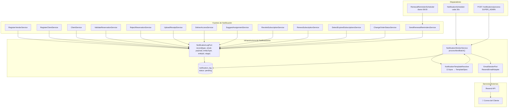
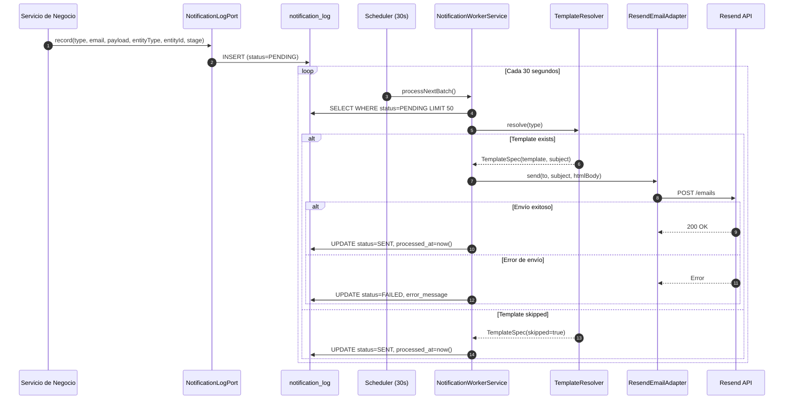
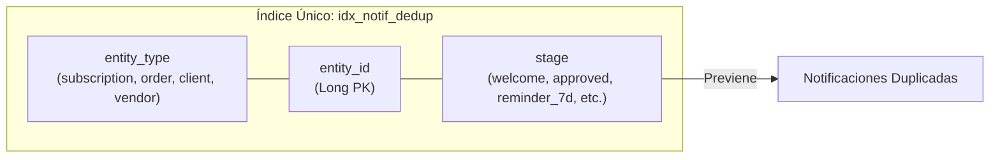

# Sistema de Notificaciones (EPIC-08)

Este diagrama describe la arquitectura del sistema de notificaciones por correo y el flujo de procesamiento.

## Arquitectura del Worker



## Flujo de Procesamiento



## Deduplicación



## Tipos de Notificación

| Tipo | entity_type | stage | Template | Disparador |
|:---|:---|:---|:---|:---|
| `VENDOR_WELCOME` | vendor | welcome | vendor-welcome | Registro vendor |
| `CLIENT_REGISTRATION` | client | welcome | client-registration | Registro cliente (auth) |
| `CLIENT_WELCOME` | client | welcome | client-welcome | Registro cliente (manual) |
| `PAYMENT_APPROVED` | order | approved | payment-approved | Validación de reserva |
| `RECEIPT_REJECTED` | order | rejected | receipt-rejected | Rechazo de comprobante |
| `RECEIPT_UPLOADED` | order | receipt_uploaded | receipt-uploaded | Subida de comprobante |
| `ACCESS_DELIVERED` | subscription | access_delivered | access-delivered | Asignación confirmada |
| `NO_INVENTORY_ALERT` | vendor | no_inventory | no-inventory-alert | Sin perfiles disponibles |
| `ACCESS_REVOKED` | subscription | revoked | access-revoked | Revocación manual |
| `SUBSCRIPTION_RENEWED` | subscription | renewed | subscription-renewed | Renovación exitosa |
| `SUBSCRIPTIONS_EXPIRED_DAILY` | vendor | expired_daily | expired-daily | Cron diario 02:00 |
| `SUBSCRIPTION_EXPIRED` | subscription | due | subscription-expired | Cron diario 02:00 |
| `RENEWAL_REMINDER_7D` | subscription | reminder_7d | renewal-reminder | Cron diario 08:00 |
| `RENEWAL_REMINDER_3D` | subscription | reminder_3d | renewal-reminder | Cron diario 08:00 |
| `RENEWAL_REMINDER_1D` | subscription | reminder_1d | renewal-reminder | Cron diario 08:00 |

## Configuración

```yaml
# application.yaml
neversion:
  email:
    from: ${NEVERSION_EMAIL_FROM}
    resend-api-key: ${RESEND_API_KEY}
  cron:
    notification-worker:
      enabled: ${NEVERSION_CRON_NOTIFICATION_WORKER_ENABLED:false}
      interval-ms: 30000
    renewal-reminders:
      enabled: false
      cron: "0 0 8 * * *"
    subscription-expiry:
      enabled: false
      cron: "0 0 2 * * *"
```
