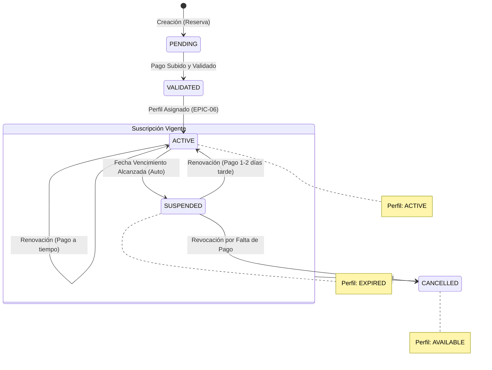

# Ciclo de Vida de la Suscripción (EPIC-07)

Este diagrama describe los estados y transiciones de una suscripción y sus recursos vinculados.

## Reglas de Transición (BR-07)
1.  **Renovación Temprana/A Tiempo:** La nueva fecha de vencimiento se calcula sumando la duración del servicio a la fecha de vencimiento **original**.
2.  **Renovación Tardía (>= 3 días):** La nueva fecha de vencimiento se calcula desde la **fecha de pago actual**.
3.  **Detección de Vencimiento:** Proceso automático diario que cambia `ACTIVE -> SUSPENDED` y marca el perfil como `EXPIRED`.
4.  **Revocación:** Libera el perfil inmediatamente marcándolo como `AVAILABLE` para que pueda ser re-vendido.
