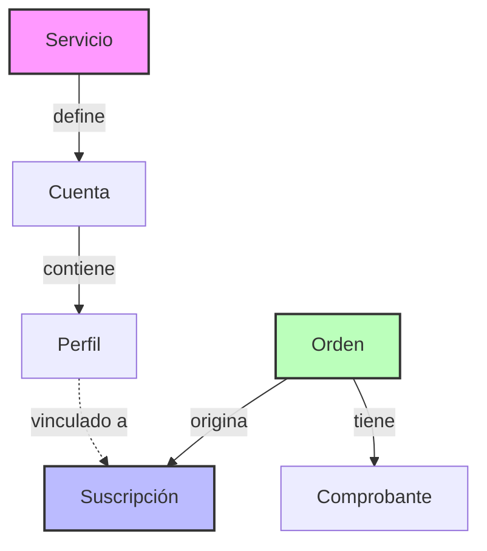
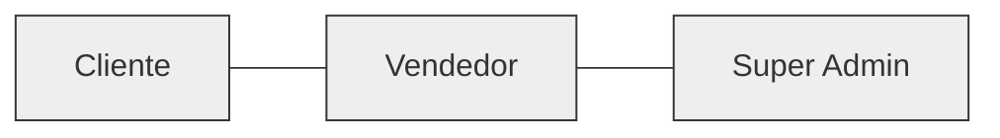
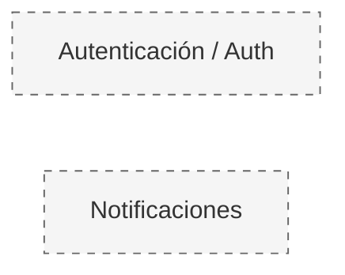

# B.2 Actor / Role Map

| Actor | Rol en el sistema | Alcance |
| :--- | :--- | :--- |
| **Super Admin** | Control total del sistema | **Global** — Todos los negocios y configuraciones base. |
| **Vendedor** | Operador de su propio negocio | **Tienda propia** — Sus cuentas, perfiles, clientes y suscripciones. |
| **Cliente** | Comprador y usuario final | **Personal** — Sus propias órdenes, suscripciones y accesos. |

### Permisos por Actor

#### Super Admin
- **Gestión de Vendedores:** Crear, administrar, activar y desactivar tiendas.
- **Supervisión Global:** Ver métricas de todo el sistema e intervenir en cuentas, órdenes o suscripciones de cualquier vendedor.
- **Configuración Maestro:** Definir configuraciones base del sistema y gestionar planes/licencias.

#### Vendedor
- **Operación de Catálogo:** Gestionar servicios, cuentas y perfiles.
- **Control de Inventario:** Ver disponibilidad de cuentas y perfiles.
- **Gestión Financiera:** Aprobar comprobantes de pago y consultar KPIs básicos del negocio.
- **Flujo de Ventas:** Confirmar asignaciones, completar órdenes y enviar accesos.
- **Suscripciones:** Crear, renovar y revocar suscripciones.
- **CRM:** Gestionar clientes (visualización y creación manual).

#### Cliente
- **Autenticación:** Registrarse e iniciar sesión.
- **Compras:** Crear órdenes, subir comprobantes y renovar servicios.
- **Dashboard Personal:** Ver suscripciones activas, accesos, fechas de vencimiento e historial de pagos.
- **Perfil:** Editar datos básicos y recibir notificaciones por correo.

---

# B.3 Domain Model (Essential)

Los dominios identificados y sus responsabilidades se estructuran de la siguiente manera:

### Core Domain
El corazón del negocio: la gestión de servicios compartidos y su ciclo de vida.

### Supporting Domain
Entidades que dan soporte a la operación comercial.

### Generic Domain
Funcionalidades transversales no específicas del modelo de negocio.

### Relaciones Clave

- **Servicio ➔ Cuenta:** Un `Servicio` define las reglas base (ej. Netflix) de una `Cuenta`.
- **Cuenta ➔ Perfil:** Una `Cuenta` contiene uno o más `Perfiles`.
- **Perfil ➔ Suscripción:** Un `Perfil` puede estar vinculado a una `Suscripción` activa.
- **Orden ➔ Suscripción:** Una `Orden` origina una o más `Suscripciones`.
- **Comprobante ➔ Orden:** Un `Comprobante` pertenece a una `Orden`.
- **Cliente ➔ Vendedor:** Un `Cliente` pertenece a un solo `Vendedor`.
