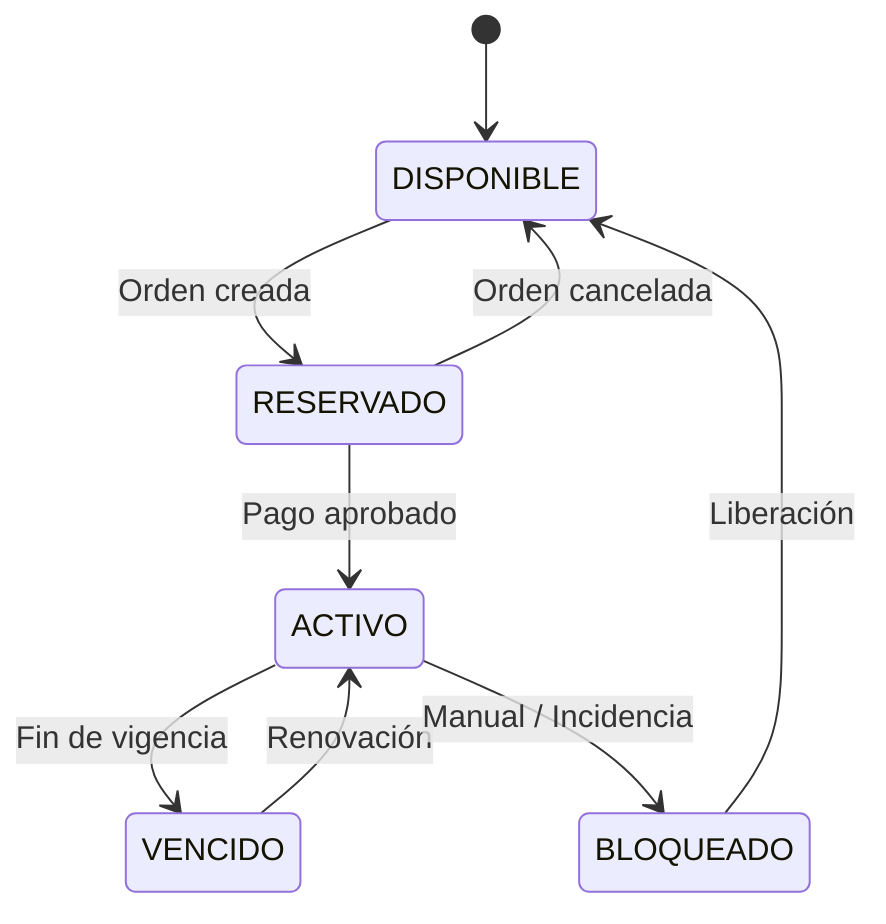

# B.4 Business Rules Document

Este documento define las reglas de negocio que rigen el comportamiento del sistema Neversion. Estas reglas son mandatorias y deben reflejarse en la implementación de la lógica de dominio.

## Resumen de Reglas de Negocio

| ID | Regla de Negocio | Categoría |
| :--- | :--- | :--- |
| **BR-01** | Modalidades de venta | Ventas |
| **BR-02** | Estructura de cuenta | Inventario |
| **BR-03** | Generación de perfiles | Inventario |
| **BR-04** | Estados de perfil | Inventario |
| **BR-05** | Ciclo de vida de una orden | Órdenes |
| **BR-06** | Aprobación de comprobante | Pagos |
| **BR-07** | Regla de renovación tardía | Suscripciones |
| **BR-08** | Inicio de vigencia | Suscripciones |
| **BR-09** | Duración estándar | Suscripciones |
| **BR-10** | Revocación de acceso | Suscripciones |
| **BR-11** | Suscripciones múltiples | Clientes |
| **BR-12** | Relación cliente — vendedor | Multitenancy |
| **BR-13** | Descuentos por combo | Precios |
| **BR-14** | Pricing configurable | Precios |
| **BR-15** | Asignación semiautomática | Operaciones |
| **BR-16** | Alcance geográfico/monetario | General |
| **BR-17** | Costos y rentabilidad | Finanzas |
| **BR-18** | Operación manual | Operaciones |
| **BR-19** | Entrega de accesos | Operaciones |
| **BR-20** | Migración inicial | Operaciones |
| **BR-21** | Venta de cuenta completa | Ventas |

---

## Ventas y Precios

### BR-01 — Modalidades de venta
- El sistema soporta dos modalidades: **venta por perfil individual** y **venta de cuenta completa**.
- Una orden puede contener items de ambas modalidades simultáneamente.

### BR-13 — Descuentos por combo
- El descuento se calcula automáticamente al agregar servicios a la reservación.
- El criterio de activación es la **cantidad total de ítems** en el carrito, incluyendo servicios repetidos.
- Aplica a partir de un número mínimo de ítems configurado por el vendedor.
- Los porcentajes son **configurables** por el vendedor mediante `discount_cfg` (JSONB) en la tabla `VENDORS`.
- La estructura de configuración es:
```json
{
  "min_items": 2,
  "tiers": [
    { "from": 2, "to": 3, "discount_pct": 5 },
    { "from": 4, "to": null, "discount_pct": 10 }
  ]
}
```
- El descuento se aplica sobre el subtotal de la reservación antes de generar la orden.

### BR-14 — Pricing configurable
- El precio de un servicio puede variar según el vendedor y la duración elegida.
- Los precios deben persistirse en la orden al momento de la creación para evitar cambios retroactivos.

### BR-16 — Alcance geográfico y monetario
- El MVP opera únicamente en **Guatemala**.
- La moneda base es **GTQ (Quetzales)**.
- El diseño técnico debe permitir la expansión a otros países/monedas en el futuro.

---

## Inventario y Estructura

### BR-02 — Estructura de cuenta
- Una cuenta pertenece a un solo servicio (ej: Perfil X en Cuenta Netflix A).
- La cantidad máxima de perfiles vendibles es definida por el vendedor al configurar el servicio.

### BR-03 — Generación de perfiles
- Los perfiles son **entidades reales** con identidad propia, no simples contadores.
- Deben generarse explícitamente sobre una cuenta y pueden tener un PIN opcional.

### BR-04 — Estados de perfil


---

## Gestión de Órdenes y Pagos

### BR-05 — Ciclo de vida de una orden
Una orden debe transitar por los estados de forma secuencial sin saltos:

> [!IMPORTANT]
> Una orden en estado **COMPLETADA** es inmutable.

> [!NOTE]
> La inmutabilidad se valida en la **capa de dominio** (Application Service), no mediante triggers de base de datos. Esto es consistente con la arquitectura hexagonal del proyecto (NFR-04).

### BR-06 — Aprobación de comprobante
El vendedor es responsable de validar:
1. Monto exacto vs Total de la orden.
2. Fecha/Hora de operación válida.
3. Recepción en la cuenta bancaria correcta.

---

## Suscripciones y Vigencia

### BR-07 — Regla de renovación tardía
Esta regla define el cálculo de la nueva fecha de vencimiento:
- **Pago ≤ 2 días post-vencimiento:** La vigencia se calcula desde la **fecha de vencimiento original** (se cobra el tiempo de gracia).
- **Pago ≥ 3 días post-vencimiento:** Se considera **nueva alta**. La vigencia inicia desde el día del pago aprobado.

> [!NOTE]
> El valor de gracia (2 días) se configura como una **constante de aplicación** en el backend (`application.yml`), no en la base de datos. Si en el futuro se necesita personalización por vendedor, se puede migrar a la tabla `VENDORS` sin romper nada.

### BR-08 — Inicio de vigencia
- Por defecto, la vigencia inicia el día en que el pago es aprobado, excepto en los casos de renovación tardía definidos en **BR-07**.

### BR-09 — Duración estándar
- La duración base es de **30 días**, pero el vendedor puede configurar periodos personalizados por servicio.

### BR-10 — Revocación de acceso
- El mecanismo principal es la **eliminación del perfil** o cambio de PIN. El cambio de contraseña de la cuenta completa es excepcional.

---

## Operación y Multitenancy

### BR-12 — Relación cliente-vendedor (Multitenancy)
- Cada cliente pertenece a **un solo vendedor**. 
- No existe el concepto de "cliente global" en el MVP; un cliente no puede ver ni comprar en tiendas de otros vendedores.

### BR-15 — Asignación semiautomática
- **El vendedor debe confirmar la sugerencia** antes de entregar los accesos al cliente.

**Algoritmo de sugerencia para perfil individual (`sale_mode = 'divided'`):**
1. Filtrar cuentas del servicio solicitado con `sale_mode = 'divided'` y al menos un perfil en estado `available`.
2. Ordenar cuentas por `renewal_date` descendente (más tiempo de vigencia restante primero).
3. Dentro de la cuenta seleccionada, tomar el primer perfil en estado `available`.

**Algoritmo de sugerencia para cuenta completa (`sale_mode = 'full_account'`):**
1. Filtrar cuentas del servicio con `sale_mode = 'full_account'` y estado `available`.
2. Ordenar por `renewal_date` descendente.
3. Sugerir la primera cuenta disponible junto con su perfil dueño (`is_owner = true`), que actúa como ancla técnica de la suscripción.

### BR-18 — Operación manual
- El vendedor tiene facultad de crear clientes, órdenes y suscripciones directamente desde su panel administrativo, omitiendo el flujo de la tienda pública si es necesario.

### BR-19 — Entrega de accesos
- Los accesos se entregan vía **correo electrónico** tras la confirmación de asignación y quedan disponibles para consulta permanente en el panel del cliente.

### BR-20 — Migración inicial
- La migración se realiza **manualmente desde el panel del vendedor**, utilizando las mismas pantallas de creación existentes (US-068 a US-071).
- Se permite la carga de datos existentes (clientes, cuentas y suscripciones activas) respetando sus fechas de vencimiento reales, sin necesidad de generar órdenes históricas.
- No se requiere importación masiva vía CSV ni endpoints especiales de carga.

---

### BR-21 — Venta de cuenta completa
Cuando la modalidad de venta es `full_account` (cuenta completa):
- La suscripción se vincula al perfil dueño de la cuenta (`is_owner = true`). Este perfil funciona como ancla técnica para mantener `subscriptions.profile_id` obligatorio y evitar un modelo paralelo de suscripciones por cuenta.
- **Todos los perfiles** de la cuenta se marcan como `active` mientras la suscripción completa esté vigente.
- La cuenta pasa a estado `full`.
- No se pueden crear suscripciones individuales por perfil en esa cuenta mientras exista una suscripción `full_account` activa.
- Al vencer o revocar la suscripción completa, **todos los perfiles** regresan a estado `available` y la cuenta regresa a `available`, permitiendo venderla nuevamente por perfiles o como cuenta completa.
- El cliente recibe las **credenciales de la cuenta maestra** (email + contraseña) y el nombre/PIN del perfil dueño si aplica.
