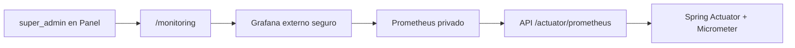

# Plan de Observabilidad para Super Admin

Fecha: 2026-05-11

## Objetivo

Separar la experiencia de `super_admin` del panel operativo de vendedores.

El `super_admin` debe usar el panel solo para:

- Gestionar vendedores.
- Acceder a monitoreo real del backend.

No debe ver informacion privada u operativa de vendedores como servicios, cuentas, clientes, suscripciones, reservas u ordenes.

## Arquitectura Objetivo



## Decision Actual

- El panel usara un link externo seguro hacia Grafana.
- No se intentara embeber Grafana con iframe en esta fase.
- Prometheus no debe exponerse publicamente.
- Grafana puede exponerse publicamente solo si queda protegido con login y HTTPS.
- Prometheus consultara el backend por red interna de Docker/Dokploy.
- `/actuator/prometheus` debe protegerse con un token de servicio para scrape automatizado.

## Estado Actual Verificado

- El backend ya incluye `spring-boot-starter-actuator`.
- El backend ya incluye `micrometer-registry-prometheus`.
- `application.yaml` expone `health`, `info` y `prometheus`.
- `/actuator/health` es publico.
- `/actuator/**` requiere `ROLE_SUPER_ADMIN`.
- El `compose.prod.yml` del API no levanta Prometheus ni Grafana.
- Existe `apps/api/monitoring/prometheus.yml`, pero no esta integrado al compose de produccion.
- Existe `apps/api/monitoring/grafana/datasources.yml`, pero no hay servicio Grafana versionado en produccion.
- El panel actual redirige `super_admin` a `/vendors`.
- El dashboard de KPIs es solo para `vendor`.

## Responsabilidades del Agente

### Backend

- Ajustar seguridad de `/actuator/prometheus` para aceptar un token de servicio.
- Mantener `/actuator/health` publico.
- Mantener `/actuator/**` protegido para `SUPER_ADMIN`.
- Agregar tests de seguridad para:
  - `/actuator/health` sin token.
  - `/actuator/prometheus` sin token.
  - `/actuator/prometheus` con token incorrecto.
  - `/actuator/prometheus` con token correcto.
- Documentar la variable `NEVERSION_MONITORING_SCRAPE_TOKEN`.

### Configuracion Versionada

- Actualizar `apps/api/monitoring/prometheus.yml` para usar `Authorization: Bearer`.
- Actualizar provisioning de Grafana si hace falta.
- Agregar README operativo para Dokploy si se aprueba.
- Crear diagrama Mermaid en `docs/diagrams/` al completar la implementacion.

### Panel

- Cambiar la navegacion para que `super_admin` vea solo:
  - Vendedores.
  - Monitoreo.
- Crear ruta `/monitoring` protegida por `super_admin`.
- Crear pantalla de monitoreo con link externo seguro a Grafana.
- Usar una variable de configuracion para la URL de Grafana.
- Actualizar `docs/implementation/panel-construction.md`.

## Responsabilidades Manuales de Alex

### Dokploy

- Crear una app/servicio para Prometheus.
- Crear una app/servicio para Grafana.
- Conectar API, Prometheus y Grafana a una red Docker comun, o confirmar el nombre interno correcto entre apps.
- Definir si Grafana tendra dominio publico.
- Confirmar que Prometheus no quede expuesto publicamente.

### Secretos

- Generar un token fuerte para `NEVERSION_MONITORING_SCRAPE_TOKEN`.
- Configurar ese token en el API.
- Configurar ese mismo token en Prometheus.
- Definir credenciales admin de Grafana.
- Configurar la URL publica de Grafana para el panel.

### Seguridad Externa

- Activar HTTPS para Grafana via Dokploy/Traefik.
- Desactivar acceso anonimo en Grafana.
- Opcional: proteger Grafana con allowlist, autenticacion de proxy o reglas adicionales.

### Validacion en Produccion

- Confirmar que Prometheus puede scrapear el API.
- Confirmar que el target del API aparece como `UP` en Prometheus.
- Confirmar que Grafana detecta Prometheus como datasource.
- Confirmar que el link del panel abre Grafana.
- Confirmar que `super_admin` no ve pantallas privadas de vendedores.

## Variable Definida

Nombre de la URL de Grafana en el panel:

```text
GRAFANA_URL
```

## Orden de Implementacion Recomendado

1. Backend: token de scrape para `/actuator/prometheus` y tests.
2. Configuracion: Prometheus y Grafana versionados para Dokploy.
3. Panel: rutas/sidebar para `super_admin` y pantalla `/monitoring`.
4. Documentacion: bitacoras y diagrama.
5. Validacion manual en Dokploy.

## Riesgos y Decisiones Pendientes

- El nombre interno del servicio API en la red de Dokploy puede no ser `app:8080`.
- Prometheus necesita acceso estable por red interna al API.
- El link a Grafana requiere una URL publica protegida.
- No se debe exponer Prometheus publicamente.
- No se debe exponer `/actuator/prometheus` sin token de servicio.
